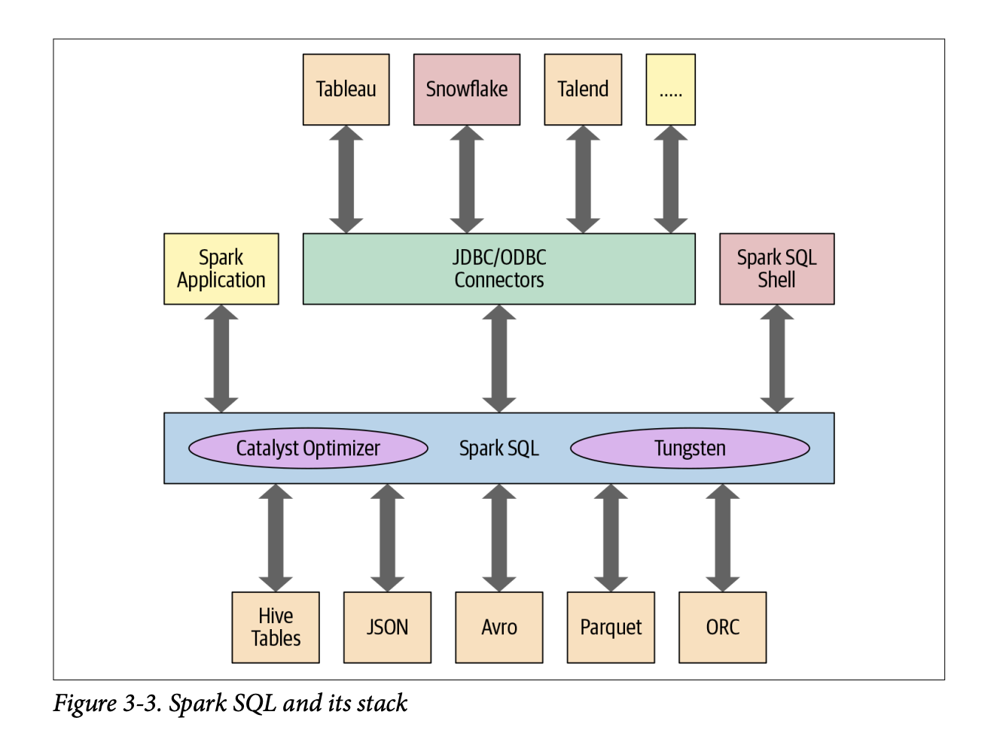
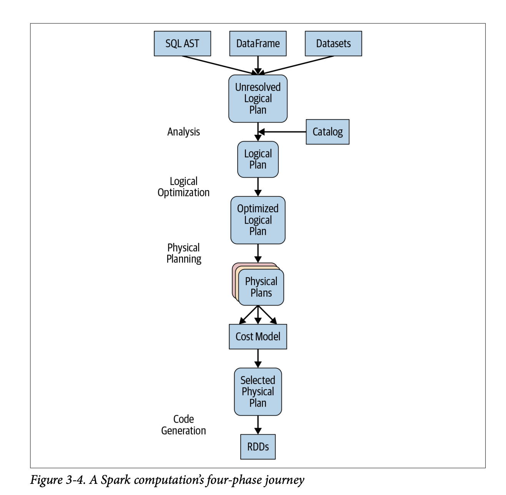

# Apache Spark's Structured APIs

When Spark was first introduced, it worked primarily with RDDs. As the ecosystem matured, the need for a higher-level API that could handle structured data like tables in a database became apparent.

This led to the development of the Structured APIs, which provide a more user-friendly way to work with structured data in Spark.

## What is Underneath an RDD?

The RDD, short for Resilient Distributed Dataset, is the fundamental data structure in Spark. It is an immutable, distributed collection of objects that can be processed in parallel.

The three vital characteristics associated with an RDD are dependencies, partitions, and compute function. 

1. A list of __dependencies__ instructs Spark how an RDD is constructed with its inputs required. When necessary to reproduce results, Spark can recreate an RDD from these dependencies and replicate operations on it. This gives RDDs resiliency.

2. __Partitions__ provide Spark the ability to split the work to parallelize computation on partitions across executors. In some cases, for example, reading from HDFS, Spark will use locality information to send work to executors close to the data. That way less data is transmitted over the network.

3. Finally an RDD has a __compute function__ that produces an `Iterator[T]` for the data that will be stored in the RDD.

However, there were a couple of problems with this original model:

1. RDDs do not have a schema, which means that Spark does not know the data types of the data in the RDD. This makes it difficult to optimize the data and perform operations on it.

2. Spark has no way to optimize the expression as it has no comprehension of its intention since it is unable to inspect the computation or expression in the function.


## Structuring Spark

The next version of Spark, Spark 2.x, introduced Structured APIs—transforming Spark from a functional programming library into a data-aware, declarative query engine.

- Instead of instructing Spark how to loop through records and manipulate data step-by-step, you declare what transformation you want `(e.g., df.groupBy("department").agg(avg("salary"))).`

- Structured APIs provide a Domain-Specific Language (DSL) that works identically across all supported programming languages (Python, Scala, Java, R) and unifies core batch processing with streaming (Structured Streaming) and machine learning (MLlib).

- By enforcing structured schemas, Spark understands exact column names and data types, enabling columnar compression and advanced query optimizations.

## The DataFrame API

Inspired by pandas DataFrames in structure, format, and a few specific operations, Spark DataFrames are like distributed in-memory tables with named columns and schemas, where each column has a specific data type. 

Conceptually, a DataFrame is a distributed, in-memory table with named columns and defined schemas, conceptually equivalent to a relational database table or an R/Pandas DataFrame, but distributed across a cluster.

### Immutability & Lineage
Like RDDs, DataFrames are immutable. Applying a transformation (such as filter() or select()) does not modify the existing DataFrame; it creates a new one.

Spark builds a directed acyclic graph (DAG) of these transformations (lineage). Because transformations are lazily evaluated, Spark waits until an action (e.g., show(), count(), write) is called before executing any physical computation.

### Schemas and Data Types
A Schema defines the column names and exact data types of a DataFrame.

- By default, Spark can infer schemas dynamically by reading a sample of the underlying file. However, defining explicit schemas programmatically or via DDL (Data Definition Language) strings is heavily recommended in production.

    - Why? Schema inference triggers an extra background job to scan file contents, slowing down pipeline initialization. Moreover, explicit schemas catch corrupted data and type mismatches immediately upon loading.

- Supports basic types `(StringType, IntegerType, BooleanType, TimestampType)` as well as complex nested types `(ArrayType, MapType, StructType)`.

There are two ways of defining a schema in Spark, the programmatic way and the DDL way. Below is an example of each.

```python
from pyspark.sql.types import *

# Programmatic schema
programmatic_schema = StructType([
    StructField("col1", StringType(), True),
    StructField("col2", IntegerType(), True),
    StructField("col3", BooleanType(), True),
    StructField("col4", TimestampType(), True),
    StructField("col5", ArrayType(StringType()), True),
    StructField("col6", MapType(StringType(), StringType()), True),
    StructField("col7", StructType([
        StructField("col7_1", StringType(), True),
        StructField("col7_2", IntegerType(), True)
    ]), True)
])

# DDL schema
ddl_schema = StructType.fromDDL("""
    col1 STRING, 
    col2 INT, 
    col3 BOOLEAN, 
    col4 TIMESTAMP, 
    col5 ARRAY<STRING>, 
    col6 MAP<STRING, STRING>, 
    col7 STRUCT<col7_1: STRING, col7_2: INT>
""")
```

### Columns and Rows

- `Columns`: Represent logical expressions evaluated per row. Columns can be manipulated mathematically, logically, or string-wise without writing custom loops (e.g., `col("price") * col("tax_rate")`).

- `Rows`: A generic record object representing a single row of data. While columns are typed, an untyped `Row` object can contain fields of varying data types accessed by positional index or field name.

```python
from pyspark.sql import Row

df.withColumn("age_in_2035", col("birthYear") - 2035)

df.withColumn("id", (concat(col("firstName"), lit("_"), col("lastName"))).alias("fullName"))

# Create a Row
r = Row(name="Alice", age=30, city="New York")

# Access fields
print(r["name"])  # Alice
print(r.age)    # 30
```

### DataFrame Operations

Some common DataFrame operations are: 

#### Reading and Saving Data

First, when loading data:

```python
file = "data/mnm_dataset.csv"
df = spark.read.csv(file, header=True, inferSchema=True)
```

When saving a DataFrame, we can specify the format of the file we want to save it as:

```python
df.write.format("parquet").mode("overwrite").save("data/mnm_dataset.parquet")

# Saving as one file
df.coalesce(1).write.format("parquet").mode("overwrite").save("data/mnm_dataset.parquet") 

```

The formats can be `parquet`, `json`, `csv`, `orc`, `text`, etc. The mode can be `append`, `overwrite`, `errorifexists`, `ignore`.

To save as a table, which registers metadata with the Hive metastore,

```python
df.write.format("parquet").mode("overwrite").saveAsTable("table_name")
```

#### Transformations and Actions

First, `filter()` and `where()` are equivalent.

```python
df.filter(col("age") > 25).show()

# Or
df.where(col("age") > 25).show()
```

#### Renaming, adding, and dropping columns

We may want to rename particular columns for reasons of style or convention. First, by specifying the desired column names in the schema with `StructField`, we effectively change the names in the resulting DataFrame.

We can also use `withColumnRenamed` method.

```python
df = df.withColumnRenamed("col_1", "column_1")

# Drop a column
df = df.drop("column_1")

# Add a column
df = df.withColumn("column_2", col("column_1") + 1)
```

We can also modify the contents of a column or its types based on data type, for example.

```python
from pyspark.sql.types import *

df = (
    df.withColumn("date", to_timestamp(col("date"), "yyyy-MM-dd"))
    .withColumn("quantity", col("quantity").cast(IntegerType()))
    .withColumn("sale", col("quantity") * 1.05)
)
```

#### Aggregations

We may want to perform transformations and actions on DataFrames such as `groupBy()`, `orderBy()`, and `count()`. We can use the `agg()` method to perform aggregations on DataFrames, more when combining operations, or simply using the specific method is enough. We can import functions from `pyspark.sql.functions`.

```python
from pyspark.sql.functions import *

df.groupBy("State").agg(count("State").alias("count"), avg("sales").alias("avg_sales"))

df.select("State", "Sales").orderBy(col("Sales").desc()).show()

df.select("State").where(col("State") == "TX").groupBy("State").count().orderBy("count", ascending=False).show(n=10, truncate=False)
```

Other operations include `max()`, `min()`, `sum()`, `avg()`, `count()`, `orderBy()`, `limit()`, `stat()`, `describe()`, `correlation()`, etc.

## The Dataset API

The Dataset API unifies the object-oriented programming style of RDDs with the performance optimizations of DataFrames.

- Datasets (Dataset[T]) are strongly typed collections of domain-specific objects (defined by Scala case classes or Java JavaBeans). Any syntax or type error (e.g., trying to filter a string column with a numerical expression) is caught at compile time rather than runtime.

- In Scala and Java, a DataFrame is simply a type alias for Dataset[Row], where Row is a generic, untyped object. Because Python and R are dynamically typed languages, they only support DataFrame (untyped Datasets).

- To avoid the serialization bottlenecks of standard Java objects, Datasets use specialized Encoders. Encoders translate between domain-specific JVM objects and Spark's internal, compact tabular memory format (Tungsten). This allows Spark to perform operations like filtering directly on serialized bytes without deserializing the entire object.

### Creating Datasets

As with creating DataFrames from data sources, when creating a Dataset you have to know the schema. If you are creating a Dataset from scratch, you can define a schema using a case class (for Scala) or a Java class (for Java) that maps to the structure of your data.

### Choosing Among APIs - When to Use What

The table below summarises how to choose among the three APIs:

| API | Best Used For | Key Advantages | Trade-offs |
| --- | --- | --- | --- |
| DataFrame | Most big data engineering, interactive exploration, PySpark/R pipelines, MLlib | Automatic Catalyst query optimization, Off-heap memory management, Universal language support | Lacks compile-time type safety (errors occur at runtime) |
| Dataset | Complex domain logic in Scala/Java, applications requiring strict type safety | Compile-time type verification, Functional programming primitives, Optimized object serialization via Encoders | Slightly higher serialization overhead than raw DataFrames, Not available in Python or R |
| RDD | Unstructured data, low-level physical control, legacy third-party library integration | Absolute control over partitioning and physical execution, Ability to process non-tabular data structures | No Catalyst optimization, High JVM GC overhead and slow serialization, Verbose, procedural code |

## Spark SQL Engine & Architectural Optimizations

The structural APIs owe their speed to the underlying Spark SQL execution engine, which is powered by two foundational components: The Catalyst Optimizer and Project Tungsten.

At a programmatic level, Spark SQL allows developers to issue ANSI SQL:2003-compatible queries on structured data with a schema. 

The Spark SQL engine provides:

- Unifies Spark components and permits abstraction to DataFrames/Datasets in
Java, Scala, Python, and R, which simplifies working with structured data sets.
- Connects to the Apache Hive metastore and tables.
- Reads and writes structured data with a specific schema from structured file for‐
mats (JSON, CSV, Text, Avro, Parquet, ORC, etc.) and converts data into tempo‐
rary tables.
- Offers an interactive Spark SQL shell for quick data exploration.
- Provides a bridge to (and from) external tools via standard database JDBC/
ODBC connectors.
- Generates optimized query plans and compact code for the JVM, for final
execution.




### The Catalyst Optimizer
Catalyst takes a declarative query (from SQL or DataFrames) and transforms it into an optimized physical execution plan through four distinct phases:



- `Analysis`: Resolves column and table names by checking them against an internal Catalog of data structures, producing an abstract Unresolved Logical Plan.

- `Logical Optimization`: Applies rule-based optimization techniques to create an Optimized Logical Plan. Key techniques include:

    - `Predicate Pushdown`: Pushing filtering criteria as close to the data source as possible (e.g., filtering rows at the database or Parquet storage layer before loading them into memory).

    - `Column Pruning`: Stripping out columns that are not referenced in the final output to minimize data transfer.

    - `Constant Folding & Boolean Simplification`: Evaluating static mathematical or logical expressions at compile time rather than for every row.

- `Physical Planning`: Takes the optimized logical plan and generates multiple physical execution strategies. It uses cost-based models to select the most efficient physical plan (for example, determining whether to perform a Broadcast Hash Join over a Sort-Merge Join based on table sizes).

- `Code Generation`: Generates optimized Java bytecode to run on each machine across the cluster.

### Project Tungsten
While Catalyst optimizes the query logic, Project Tungsten optimizes physical hardware utilization (CPU and memory):

- `Off-Heap Memory Management`: Instead of storing records as standard Java objects on the JVM heap, Tungsten stores data in a compact, binary format directly in off-heap memory. This completely eliminates garbage collection pauses and allows Spark to pack significantly more data into RAM.

- `Cache-Aware Computation`: Algorithms and data structures are designed to exploit L1, L2, and L3 CPU caches efficiently, reading data sequentially to avoid CPU cache misses.

- `Whole-Stage Code Generation`: Instead of executing operators one-by-one (which requires constantly passing data between functions and handling virtual method dispatch), Tungsten collapses the entire query graph into a single, unified Java function at runtime. This mimics the performance of hand-optimized, compiled C++ code.