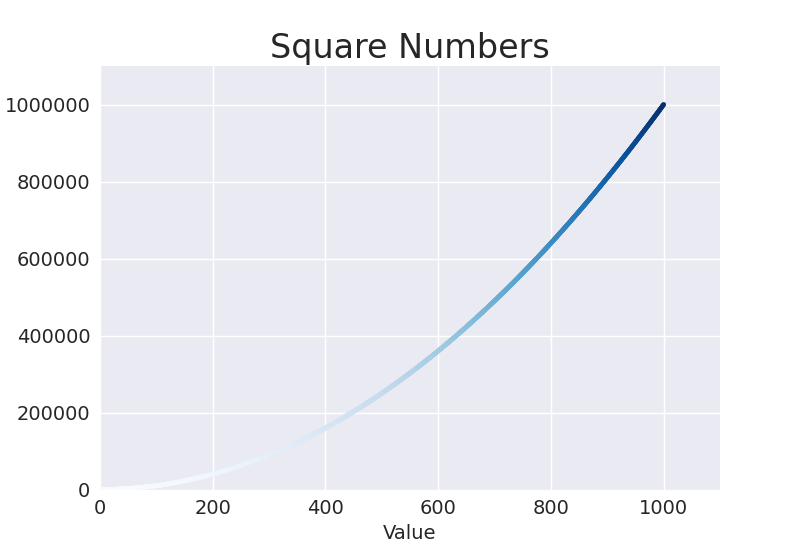

# Generating Data

Data visualization involves the use of visual representations to explore and present patterns in datasets, which is what will be explored here.

## Installing Matplotlib and plotting a simple line graph

We use:

```
python -m pip install --user matplotlib
```

or 

```
python3 -m pip install --user matplotlib
```

To plot a simple line graph, we use:

```python

import matplotlib.pyplot as plt

squares = [1, 4, 9, 16, 25]

fig, ax = plt.subplots()
ax.plot(squares)

plt.show()
```

- `subplots()` helps generate more than one plot in the same figure. The variable `fig` represents the entire `figure`, which is the collection of plots that are generated. The variable `ax` represents a single plot in the figure.

### Adding labels

We can add a title, customize our chart by adding more text properties or increase linewidth.

```python

import matplotlib.pyplot as plt

squares = [1, 4, 9, 16, 25]

fig, ax = plt.subplots()
ax.plot(squares, linewidth=3)

# Set chart title and label axes
ax.set_title("Square numbers", fontsize=24)
ax.set_xlabel("Value", fontsize=14)
ax.set_ylabel("Square of Value", fontsize=14)

# Set size of tick labels
ax.tick_params(labelsize=14)

plt.show()
```

### Correcting the Plot

The data may not be correctly plotted. Based on our values, when we give `plot()` a single sequence of numbers, it assumes the first data point corresponds to an x-value of 0, but our first point corresponds to an x-value of 1. We can override the default behavior by giving plot() both the input and output values used to calculate the squares:

```python

import matplotlib.pyplot as plt

input_values = [1, 2, 3, 4, 5]
squares = [1, 4, 9, 16, 25]

fig, ax = plt.subplots()
ax.plot(input_values, squares, linewidth=3)

# Set chart title and label axes
ax.set_title("Square numbers", fontsize=24)
ax.set_xlabel("Value", fontsize=14)
ax.set_ylabel("Square of Value", fontsize=14)

# Set size of tick labels
ax.tick_params(labelsize=14)

plt.show()
```

### Using Built-in Styles

Matplotlib has some predefined styles available. They can be seen by running;

```python

import matplotlib.pyplot as plt
plt.style.available

```

```
>>> plt.style.available
['Solarize_Light2', '_classic_test_patch', '_mpl-gallery', '_mpl-gallery-nogrid', 'bmh', 'classic', 'dark_background', 'fast', 'fivethirtyeight', 'ggplot', 'grayscale', 'petroff10', 'seaborn-v0_8', 'seaborn-v0_8-bright', 'seaborn-v0_8-colorblind', 'seaborn-v0_8-dark', 'seaborn-v0_8-dark-palette', 'seaborn-v0_8-darkgrid', 'seaborn-v0_8-deep', 'seaborn-v0_8-muted', 'seaborn-v0_8-notebook', 'seaborn-v0_8-paper', 'seaborn-v0_8-pastel', 'seaborn-v0_8-poster', 'seaborn-v0_8-talk', 'seaborn-v0_8-ticks', 'seaborn-v0_8-white', 'seaborn-v0_8-whitegrid', 'tableau-colorblind10']
>>> 
```

We could use one of the styles

```python

import matplotlib.pyplot as plt

input_values = [1, 2, 3, 4, 5]
squares = [1, 4, 9, 16, 25]

plt.style.use('seaborn-v0_8')
fig, ax = plt.subplots()
ax.plot(input_values, squares, linewidth=3)

# Set chart title and label axes
ax.set_title("Square numbers", fontsize=24)
ax.set_xlabel("Value", fontsize=14)
ax.set_ylabel("Square of Value", fontsize=14)

# Set size of tick labels
ax.tick_params(labelsize=14)

plt.show()
```

### Plotting and styling Individual points with `scatter()`

If we want to plot a single point, we can pass the single x and y values to the point to `scatter()`

```python
import matplotlib.pyplot as plt

plt.style.use('seaborn-v0_8')
fig, ax = plt.subplots()
ax.scatter(2, 4)

plt.show()
```

Adding more styling:

```python
import matplotlib.pyplot as plt

plt.style.use('seaborn-v0_8')
fig, ax = plt.subplots()
ax.scatter(2, 4, s=200)

ax.set_title("Square Numbers", fontsize=24)
ax.set_xlabel("Value", fontsize=14)
ax.set_ylabel("Square of Value", fontsize=14)

ax.tick_params(labelsize=14)

plt.show()
```

The argument `s` in `ax.scatter(2, 4, s=200)` is used to set the size of the dots used to draw the graph. 

# Plotting a Series of Points with `scatter()`

```python
import matplotlib.pyplot as plt

x_values = [1, 2, 3, 4, 5]
y_values = [1, 4, 9, 16, 25]

plt.style.use("seaborn-v0_8")
fig, ax = plt.subplots()
ax.scatter(x_values, y_values, s=100)

ax.set_title("Square Numbers", fontsize=24)
ax.set_xlabel("Value", fontsize=14)
ax.set_ylabel("Square of Value", fontsize=14)

ax.tick_params(labelsize=14)

plt.show()
```

### Calculating Data Automatically

Writing lists by hand can be inefficient, especially when we have many points. Rather than writing out each value, we can use a loop to do the calculations for us.

```python
import matplotlib.pyplot as plt

x_values = range(1, 1001)
y_values = [x**2 for x in x_values]

plt.style.use("seaborn-v0_8")
fig, ax = plt.subplots()
ax.scatter(x_values, y_values, s=10)

ax.set_title("Square Numbers", fontsize=24)
ax.set_xlabel("Value", fontsize=14)
ax.set_ylabel("Square of Value", fontsize=14)

ax.tick_params(labelsize=14)

ax.axis([0, 1100, 0, 1_100_000])

plt.show()
```

In this last part, `ax.axis([0, 1100, 0, 1_100_000])`, the axis() method requires four values: the minimum and maximum values for the x-axis and the y-axis. We run the x-axis from 0 to 1,100 and the y axis from 0 to 1,100,000.

### Customizing Tick Labels

When the numbers on an axis get large enough, Matplotlib defaults to scientific notation for tick labels. This is however customizable:

```python
import matplotlib.pyplot as plt

x_values = range(1, 1001)
y_values = [x**2 for x in x_values]

plt.style.use("seaborn-v0_8")
fig, ax = plt.subplots()
ax.scatter(x_values, y_values, s=10)

ax.set_title("Square Numbers", fontsize=24)
ax.set_xlabel("Value", fontsize=14)
ax.set_ylabel("Square of Value", fontsize=14)

ax.tick_params(labelsize=14)

ax.axis([0, 1100, 0, 1_100_000])
ax.ticklabel_format(style='plain')

plt.show()
```

The `ticklabel_format()` method allows us to override the default tick label style for any plot.

### Defining Custom Colors

We can change the color of the points by passing the argument `color` to `scatter()` with the name of a color to use in quotation marks as shown here:

```python
ax.scatter(x_values, y_values, color='red', s=10)
```

We can also define the custom colors using the RGB color model:

```python
ax.scatter(x_values, y_values, color=(0, 0.8, 0), s=10)
```

Values closer to 0 produce `darker` colors, and values closer to 1 produce `lighter` colors.

### Using a Colormap

A `colormap` is a sequence of colors in a gradient that moves from a starting to an ending color. Colormaps in visualizations are used to emphasize patterns in data. For example, we may make low values a light color and high values a darker color. Using a colormap ensures that all points in the visualization vary smoothly and accurately along a well-designed color scale.

The `pyplot` module includes a set of in-built colormaps. To use one of these colormaps, one needs to specify how `pyplot` should assign a color to each point in the dataset.

```python
import matplotlib.pyplot as plt

x_values = range(1, 1001)
y_values = [x**2 for x in x_values]

plt.style.use('seaborn-v0-8')
fig, ax = plt.subplots()
ax.scatter(x_values, y_values, c=y_values, cmap=plt.cm.Blues, s=10)

ax.set_title("Square Numbers", fontsize=24)
ax.set_xlabel("Value", fontsize=14)
ax.set_ylabel("Square of Value", fontsize=14)

ax.tick_params(labelsize=14)

ax.axis([0, 1100, 0, 1_100_000])
ax.ticklabel_format(style="plain")

plt.show()
```

The `c` argument is similar to color but is used to associate a sequence of values with a color mapping. The code above colors the points with the lower y-values light blue and the points with higher y-values dark blue as shown below:



### Saving plots

To save a plot to a file, we can use the `savefig()` function. This function should be called before `plt.show()`.

```python
plt.savefig('squares_plot.png', bbox_inches='tight')
```

The initial argument is a filename. The optional argument `bbox_inches='tight'` is used to remove extra whitespace around the plot.

## Random Walks

