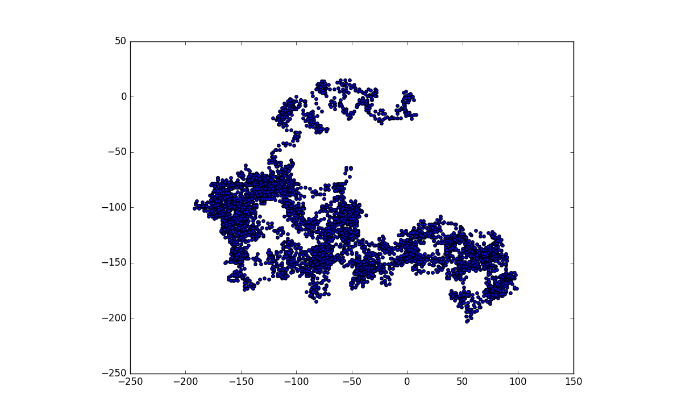
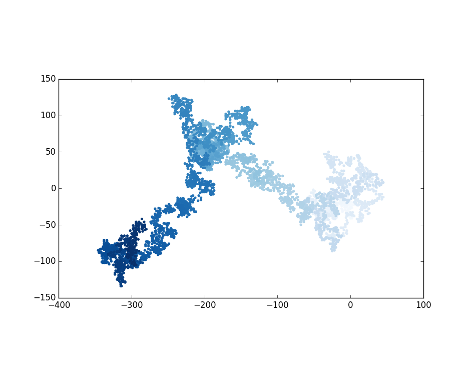
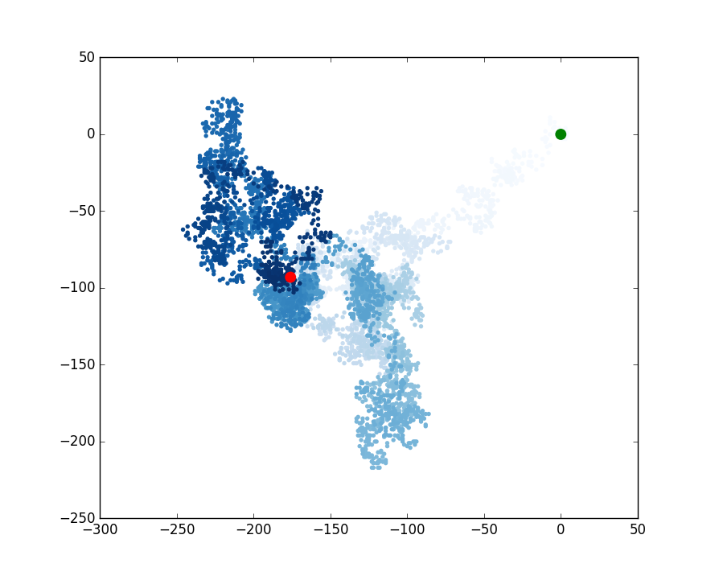
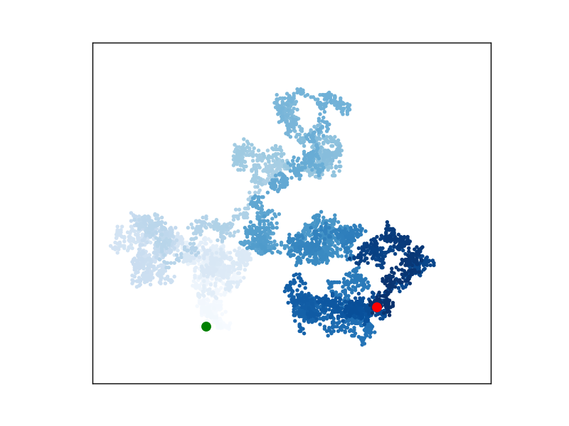
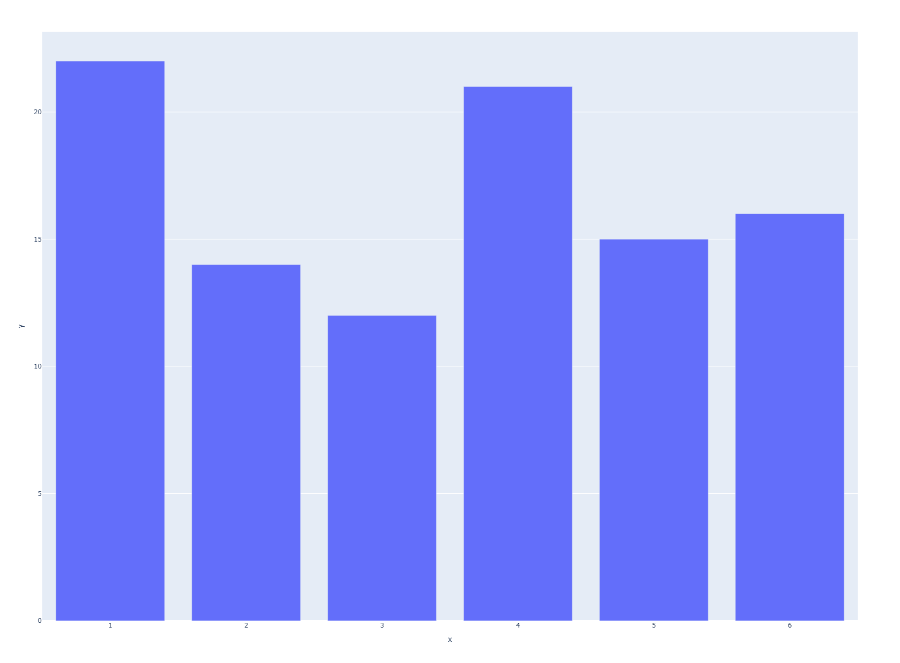
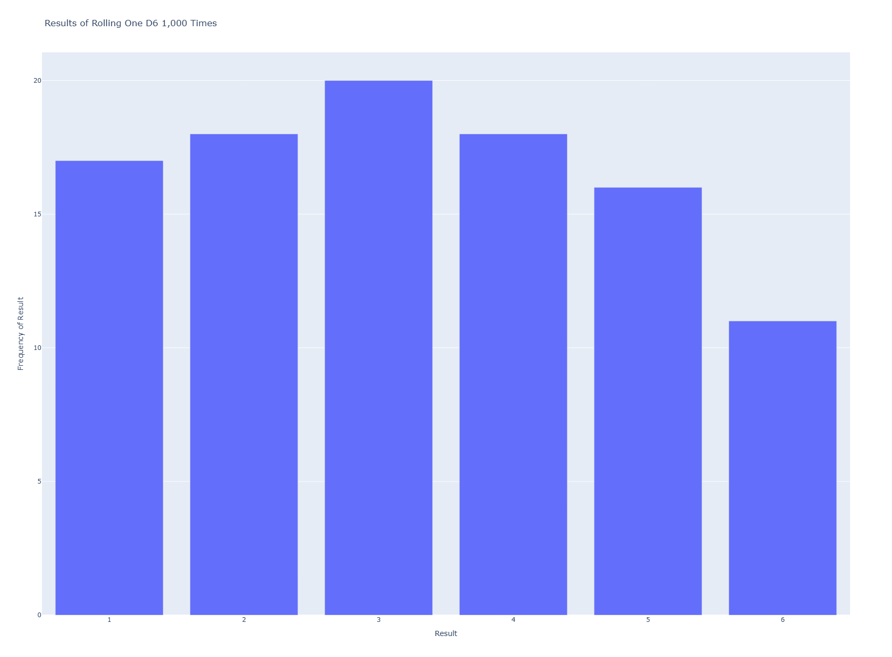

# Generating Data

Data visualization involves the use of visual representations to explore and present patterns in datasets, which is what will be explored here.

## Installing Matplotlib and plotting a simple line graph

We use:

```
python -m pip install --user matplotlib
```

or 

```
python3 -m pip install --user matplotlib
```

To plot a simple line graph, we use:

```python

import matplotlib.pyplot as plt

squares = [1, 4, 9, 16, 25]

fig, ax = plt.subplots()
ax.plot(squares)

plt.show()
```

- `subplots()` helps generate more than one plot in the same figure. The variable `fig` represents the entire `figure`, which is the collection of plots that are generated. The variable `ax` represents a single plot in the figure.

### Adding labels

We can add a title, customize our chart by adding more text properties or increase linewidth.

```python

import matplotlib.pyplot as plt

squares = [1, 4, 9, 16, 25]

fig, ax = plt.subplots()
ax.plot(squares, linewidth=3)

# Set chart title and label axes
ax.set_title("Square numbers", fontsize=24)
ax.set_xlabel("Value", fontsize=14)
ax.set_ylabel("Square of Value", fontsize=14)

# Set size of tick labels
ax.tick_params(labelsize=14)

plt.show()
```

### Correcting the Plot

The data may not be correctly plotted. Based on our values, when we give `plot()` a single sequence of numbers, it assumes the first data point corresponds to an x-value of 0, but our first point corresponds to an x-value of 1. We can override the default behavior by giving plot() both the input and output values used to calculate the squares:

```python

import matplotlib.pyplot as plt

input_values = [1, 2, 3, 4, 5]
squares = [1, 4, 9, 16, 25]

fig, ax = plt.subplots()
ax.plot(input_values, squares, linewidth=3)

# Set chart title and label axes
ax.set_title("Square numbers", fontsize=24)
ax.set_xlabel("Value", fontsize=14)
ax.set_ylabel("Square of Value", fontsize=14)

# Set size of tick labels
ax.tick_params(labelsize=14)

plt.show()
```

### Using Built-in Styles

Matplotlib has some predefined styles available. They can be seen by running;

```python

import matplotlib.pyplot as plt
plt.style.available

```

```
>>> plt.style.available
['Solarize_Light2', '_classic_test_patch', '_mpl-gallery', '_mpl-gallery-nogrid', 'bmh', 'classic', 'dark_background', 'fast', 'fivethirtyeight', 'ggplot', 'grayscale', 'petroff10', 'seaborn-v0_8', 'seaborn-v0_8-bright', 'seaborn-v0_8-colorblind', 'seaborn-v0_8-dark', 'seaborn-v0_8-dark-palette', 'seaborn-v0_8-darkgrid', 'seaborn-v0_8-deep', 'seaborn-v0_8-muted', 'seaborn-v0_8-notebook', 'seaborn-v0_8-paper', 'seaborn-v0_8-pastel', 'seaborn-v0_8-poster', 'seaborn-v0_8-talk', 'seaborn-v0_8-ticks', 'seaborn-v0_8-white', 'seaborn-v0_8-whitegrid', 'tableau-colorblind10']
>>> 
```

We could use one of the styles

```python

import matplotlib.pyplot as plt

input_values = [1, 2, 3, 4, 5]
squares = [1, 4, 9, 16, 25]

plt.style.use('seaborn-v0_8')
fig, ax = plt.subplots()
ax.plot(input_values, squares, linewidth=3)

# Set chart title and label axes
ax.set_title("Square numbers", fontsize=24)
ax.set_xlabel("Value", fontsize=14)
ax.set_ylabel("Square of Value", fontsize=14)

# Set size of tick labels
ax.tick_params(labelsize=14)

plt.show()
```

### Plotting and styling Individual points with `scatter()`

If we want to plot a single point, we can pass the single x and y values to the point to `scatter()`

```python
import matplotlib.pyplot as plt

plt.style.use('seaborn-v0_8')
fig, ax = plt.subplots()
ax.scatter(2, 4)

plt.show()
```

Adding more styling:

```python
import matplotlib.pyplot as plt

plt.style.use('seaborn-v0_8')
fig, ax = plt.subplots()
ax.scatter(2, 4, s=200)

ax.set_title("Square Numbers", fontsize=24)
ax.set_xlabel("Value", fontsize=14)
ax.set_ylabel("Square of Value", fontsize=14)

ax.tick_params(labelsize=14)

plt.show()
```

The argument `s` in `ax.scatter(2, 4, s=200)` is used to set the size of the dots used to draw the graph. 

# Plotting a Series of Points with `scatter()`

```python
import matplotlib.pyplot as plt

x_values = [1, 2, 3, 4, 5]
y_values = [1, 4, 9, 16, 25]

plt.style.use("seaborn-v0_8")
fig, ax = plt.subplots()
ax.scatter(x_values, y_values, s=100)

ax.set_title("Square Numbers", fontsize=24)
ax.set_xlabel("Value", fontsize=14)
ax.set_ylabel("Square of Value", fontsize=14)

ax.tick_params(labelsize=14)

plt.show()
```

### Calculating Data Automatically

Writing lists by hand can be inefficient, especially when we have many points. Rather than writing out each value, we can use a loop to do the calculations for us.

```python
import matplotlib.pyplot as plt

x_values = range(1, 1001)
y_values = [x**2 for x in x_values]

plt.style.use("seaborn-v0_8")
fig, ax = plt.subplots()
ax.scatter(x_values, y_values, s=10)

ax.set_title("Square Numbers", fontsize=24)
ax.set_xlabel("Value", fontsize=14)
ax.set_ylabel("Square of Value", fontsize=14)

ax.tick_params(labelsize=14)

ax.axis([0, 1100, 0, 1_100_000])

plt.show()
```

In this last part, `ax.axis([0, 1100, 0, 1_100_000])`, the axis() method requires four values: the minimum and maximum values for the x-axis and the y-axis. We run the x-axis from 0 to 1,100 and the y axis from 0 to 1,100,000.

### Customizing Tick Labels

When the numbers on an axis get large enough, Matplotlib defaults to scientific notation for tick labels. This is however customizable:

```python
import matplotlib.pyplot as plt

x_values = range(1, 1001)
y_values = [x**2 for x in x_values]

plt.style.use("seaborn-v0_8")
fig, ax = plt.subplots()
ax.scatter(x_values, y_values, s=10)

ax.set_title("Square Numbers", fontsize=24)
ax.set_xlabel("Value", fontsize=14)
ax.set_ylabel("Square of Value", fontsize=14)

ax.tick_params(labelsize=14)

ax.axis([0, 1100, 0, 1_100_000])
ax.ticklabel_format(style='plain')

plt.show()
```

The `ticklabel_format()` method allows us to override the default tick label style for any plot.

### Defining Custom Colors

We can change the color of the points by passing the argument `color` to `scatter()` with the name of a color to use in quotation marks as shown here:

```python
ax.scatter(x_values, y_values, color='red', s=10)
```

We can also define the custom colors using the RGB color model:

```python
ax.scatter(x_values, y_values, color=(0, 0.8, 0), s=10)
```

Values closer to 0 produce `darker` colors, and values closer to 1 produce `lighter` colors.

### Using a Colormap

A `colormap` is a sequence of colors in a gradient that moves from a starting to an ending color. Colormaps in visualizations are used to emphasize patterns in data. For example, we may make low values a light color and high values a darker color. Using a colormap ensures that all points in the visualization vary smoothly and accurately along a well-designed color scale.

The `pyplot` module includes a set of in-built colormaps. To use one of these colormaps, one needs to specify how `pyplot` should assign a color to each point in the dataset.

```python
import matplotlib.pyplot as plt

x_values = range(1, 1001)
y_values = [x**2 for x in x_values]

plt.style.use('seaborn-v0-8')
fig, ax = plt.subplots()
ax.scatter(x_values, y_values, c=y_values, cmap=plt.cm.Blues, s=10)

ax.set_title("Square Numbers", fontsize=24)
ax.set_xlabel("Value", fontsize=14)
ax.set_ylabel("Square of Value", fontsize=14)

ax.tick_params(labelsize=14)

ax.axis([0, 1100, 0, 1_100_000])
ax.ticklabel_format(style="plain")

plt.show()
```

The `c` argument is similar to color but is used to associate a sequence of values with a color mapping. The code above colors the points with the lower y-values light blue and the points with higher y-values dark blue as shown below:


### Saving plots

To save a plot to a file, we can use the `savefig()` function. This function should be called before `plt.show()`.

```python
plt.savefig('squares_plot.png', bbox_inches='tight')
```

The initial argument is a filename. The optional argument `bbox_inches='tight'` is used to remove extra whitespace around the plot.

## Random Walks

A `random walk` is a path that is determined by a series of simple decisions, each of which is left entirely to chance. We might imagine a random walk as the path a confused ant or a child learning to walk would take if it took every step in a random direction. 

Random walks have practical applications in nature, physics, biology, chemistry, and economics. For example, a pollen grain floating on a drop of water moves across the surface of the water because it is constantly pushed around by water moleculs. Molecular motion in a water drop is random, so the path a pollen grain traces on the surface is a random walk. 

### Creating the RandomWalk Class

The `RandomWalk` class will make random decisions about which direction the walk should take. It will have three attributes: one variable to track the number of points in the walk, and two lists to store the x- and y-coordinates of each point in the walk.

We will only need two methods for the `RandomWalk` class: the `__init__()` method and `fill_walk()` method, which will calculate the points in the walk. 

```python
from random import choice

class RandomWalk:
    """A class to generate random walks"""

    def __init__(self, num_points=5000):
        """Initialize attributes of a walk"""
        self.num_points = num_points

        # All walks start at (0, 0)
        self.x_value = [0]
        self.y_value = [0]

    def fill_walk(self):
        """Calculate all the points in the walk"""
        
        # Keep taking steps until the walk reaches the desired length
        while len(self.x_values) < self.num_points:

            # Decide which direction to go, and how far to go
            x_direction = choice([1, -1])
            x_distance = choice([0, 1, 2, 3, 4])
            x_step = x_direction * x_distance

            y_direction = choice([1, -1])
            y_distance = choice([0, 1, 2, 3, 4])
            y_step = y_direction * y_distance

            # Reject moves that go nowhere
            if x_step == 0 and y_step == 0:
                continue

            # Calculate the new position
            x = self.x_values[-1] + x_step
            y = self.y_values[-1] + y_step

            self.x_values.append(x)
            self.y_values.append(y)

```

We set up the loop that runs until the walk is filled with the correct number of points. The main part of `fill_walk()` tells Python how to simulate four random decisions:

    - Will the walk go right or left?
    - How far will it go in that direction?
    - Will it go up or down?
    - How far will it go in that direction?

We use `choice([1, -1])` to choose a value for `x_direction`, which returns either 1 for movement to the right or -1 for movement to the left. Next, `choice([0, 1, 2, 3, 4])` randomly selects a distance to move in that direction. We assign this value to `x_distance` and the inclusion of a 0 allows for the possibility of steps that have movement along only one axis.

We then determine the length of each step in the x- and y-directions by multiplying the direction of movement by the distance chosen. A positive result for `x_step` means move to the right, a negative result means move to the left, and 0 means move vertically. A positive result for `y_step` means move up, negative means move down, and 0 means move horizontally. If the values for both `x_step` and `y_step` are 0, the walk does not go anywhere; when this happens, we continue the loop: `if x_step == 0 and y_step == 0: continue`

To get the next x-value for the walk, we add the value in `x_step` to the last value stored in `x_values` and do the same for the y-values. When we have the new point's coordinates, we append them to `x_values` and `y_values`

To plot the random walk;

```python

import matplotlib.pyplot as plt

from random_walk import RandomWalk

# Make a random walk
rw = RandomWalk()
rw.fill_walk()

# Plot the points in the walk
plt.style.use("classic")
fig, ax = plt.subplots()
ax.scatter(rw.x_values, rw.y_values, s=15)
ax.set_aspect("equal")
plt.show()

```

The output is as shown:



### Generating Multiple Random Walks

As every random walk is different, it would be fun to explore the various patterns that can be generated. 

One way to use the preceding code to make multiple walks without having to run the program several times is to wrap it in a while loop:

```python

import matplotlib.pyplot as plt

from random_walk import RandomWalk

# Keep making new walks, as long as the program is active.

while True:
    # Make a random walk
    rw = RandomWalk()
    rw.fill_walk()

    # Plot the points in the walk
    plt.style.use("classic")
    fig, ax = plt.subplots()

    ax.scatter(rw.x_values, rw.y_values, s=15)
    ax.set_aspect("equal")

    plt.show()

    keep_running = input("Make another walk? (y/n): ")
    if keep_running == 'n':
        break

```

### Styling the Walk

#### Coloring the Points

We use a colormap to show the order of the points in the walk, and remove the black outline from each dot so the color of the dots will be clearer. To color the points according to their position in the walk, we pass the `c` argument in a list containing the position of each point. 

Since the points are plotted in order, this list just contains the numbers from 0 to 4,999:

```python

import matplotlib.pyplot as plt

from random_walk import RandomWalk

# Make a random walk
rw = RandomWalk()
rw.fill_walk()

# Plot the points in the walk
plt.style.use("classic")
fig, ax = plt.subplots()

point_numbers = range(rw.num_points)
ax.scatter(rw.x_values, rw.y_values, c=point_numbers, cmap=plt.cm.Blues, edgecolors='none', s=15)

ax.set_aspect("equal")

plt.show()

```



#### Plotting the Starting and Ending Points

We can also show their position along the walk in addition to coloring points, which would be useful to see exactly where each walk begins and ends. 

To do so, we can plot the first and last points individually after the main series has been plotted. We will make the end points larger and color them differently to make them stand out.

```python

import matplotlib.pyplot as plt

from random_walk import RandomWalk

# Make a random walk
rw = RandomWalk()
rw.fill_walk()

# Plot the points in the walk
plt.style.use("classic")
fig, ax = plt.subplots()

point_numbers = range(rw.num_points)
ax.scatter(
    rw.x_values,
    rw.y_values,
    c=point_numbers,
    cmap=plt.cm.Blues,
    edgecolors="none",
    s=15,
)

# Emphasizxe the first and last points
ax.scatter(0, 0, c='green', edgecolors='none', s=100)
ax.scatter(rw.x_values[-1], rw.y_values[-1], c='red', edgecolors='none', s=100)

ax.set_aspect("equal")

plt.show()

```



#### Cleaning Up the Axes

We can remove the axes to avoid distracting from the path of each walk:

```python

import matplotlib.pyplot as plt

from random_walk import RandomWalk

# Make a random walk
rw = RandomWalk()
rw.fill_walk()

# Plot the points in the walk
plt.style.use("classic")
fig, ax = plt.subplots()

point_numbers = range(rw.num_points)
ax.scatter(
    rw.x_values,
    rw.y_values,
    c=point_numbers,
    cmap=plt.cm.Blues,
    edgecolors="none",
    s=15,
)

# Emphasizxe the first and last points
ax.scatter(0, 0, c="green", edgecolors="none", s=100)
ax.scatter(rw.x_values[-1], rw.y_values[-1], c="red", edgecolors="none", s=100)

# Remove the axes
ax.get_xaxis().set_visible(False)
ax.get_yaxis().set_visible(False)

ax.set_aspect("equal")

plt.show()

```



#### Adding Plot Points

We can increase the number of points, to give us more data to work with. To do so, we increase the value of `num_points` when we make a `RandomWalk` instance and adjust the size of each dot when drawing the plot:

```python
rw = RandomWalk(50_000)

---

ax.scatter(
    rw.x_values,
    rw.y_values,
    c=point_numbers,
    cmap=plt.cm.Blues,
    edgecolors="none",
    s=1,
)
```

The above would create a random walk with 50,000 points and plot each point at size `s=1`. 


#### Altering the Size to Fill the Screen

A visualization is much more effective at communicating patterns in data if it fits nicely on the screen. To make the plotting window better fit our screen, we can adjust the size of Matplotlib's output. 

```python
fig, ax = plt.subplots(figsize=(15, 9))
```

The `figsize` parameter takes a tuple that tells Matplotlib the dimensions of the plotting window in inches. Matplotlib assumes the screen resolution is 100 pixels per inch; if this code does not give us an accurate plot size, we can adjust the numbers as necessary.

Also, if we know our system's resolution, we can pass `subplots()` the resolution using the `dpi` parameter:

```python
fig, ax = plt.subplots(figsize=(10, 6), dpi=128)
```

This should help make the most efficient use of the space available on our screen. 

## Rolling Dice with Plotly

Plotly is useful when creating visualizations that will be displayed in a browser since the visualizations automatically scale to fit the viewer's screen. They are also interactive; when the user howevers 

We will build our initial visualization using `Plotly Express`, a subset of Plotly that focuses on generating plots with as little code as possible. 

### Generating the Die Class

We will create the following `Die` class to simulate the roll of one die:

```python

from random import randint

class Die:
    """A class representing a single die."""

    def __init__(self, num_sides=6):
        """Assume a six-sided die."""
        self.num_sides = num_sides

    def roll(self):
        """Return a random value between 1 and number of sides."""
        return randint(1, self.num_sides)

```

We then roll the die:

```python

from die import Die # Our code above

# Create a D6
die = Die()

# Make some rolls, and store the results in a list
results = []
for roll_num in range(100):
    result = die.roll()
    results.append(result)

print(results)

```

The code above should generate values between 1 and 6, 100 in total. 

We can start by counting how many times we roll each numnber:

```python

from die import Die  # Our code above

# Create a D6
die = Die()

# Make some rolls, and store the results in a list
results = []
for roll_num in range(100):
    result = die.roll()
    results.append(result)

# Analyze the results
frequencies = []
poss_results = range(1, die.num_sides+1)
for value in poss_results:
    frequency = results.count(value)
    frequencies.append(frequency)

print(frequencies)

```

The result, `[13, 20, 16, 21, 11, 19]` is reasonable and we see six frequencies, one for each possible number when we roll a D6. Also, no frequency is significantly higher than any other.

We can now generate a visualization in just a couple lines of code using `Plotly Express`

```python
import plotly.express as px

from die import Die

# Create a D6
die = Die()

# Make some rolls, and store the results in a list
results = []
for roll_num in range(100):
    result = die.roll()
    results.append(result)

# Analyze the results
frequencies = []
poss_results = range(1, die.num_sides + 1)
for value in poss_results:
    frequency = results.count(value)
    frequencies.append(frequency)

# Visualize the results
fig = px.bar(x=poss_results, y=frequencies)
fig.show()

```

The result is:



We can further customize the plot to add labels and styles for the chart

```python

import plotly.express as px

from die import Die

# Create a D6
die = Die()

# Make some rolls, and store the results in a list
results = []
for roll_num in range(100):
    result = die.roll()
    results.append(result)

# Analyze the results
frequencies = []
poss_results = range(1, die.num_sides + 1)
for value in poss_results:
    frequency = results.count(value)
    frequencies.append(frequency)

# Visualize the results
title = "Results of Rolling One D6 1,000 Times"
labels = {'x': 'Result', 'y':'Frequency of Result'}
fig = px.bar(x=poss_results, y=frequencies, title=title, labels=labels)
fig.show()

```

