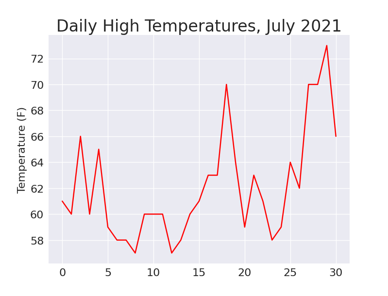

# Downloading Data

Here, we will download datasets from online sources and create working visualizations of that data. 

We will access and visualize data stored in two common data formats: `csv` and `json`

## The CSV File Format

One simple way to store data in a text file is to write the data as a series of values separated by commas, called `comma-separated-values`

### Parsing the CSV File Headers

Python's csv module in the standard library parses the lines in a CSV file and allows us to quickly extract the values we are interested in. 

To examine the first line of the file we have downloaded:

```python

from pathlib import Path
import csv

path = Path('weather_data/sitka_weather_07-2021_simple.csv')
lines = path.read_text(encoding='utf-8').splitlines()

reader = csv.reader(lines)
header_row = next(reader)
print(header_row)

```

First, we read the file and chain the `splitlines()` method to get a list of all lines in the file, which we assign to `lines`

Next, we build a `reader` object, which is an object that can be used to parse each line in the file. To make a reader object, we call the function `csv.reader()` and pass it the list of lines from the CSV file.

When given a `reader` object, the `next()` function returns the next line in the file, starting from the beginning of the file. 

Here, we call `next()` only once, so we get the first line of the file, which contains the file headers.

### Printing the Headers and Their Positions

To make it easier to understand the file header data, we can print each header and its position in the list:

```python

--snip--

reader = csv.reader(lines)
header_row = next(reader)

for index, column_header in enumerate(header_row):
    print(index, column_header)
```

output:
```
0 STATION
1 NAME
2 DATE
3 TAVG
4 TMAX
5 TMIN
```

The `enumerate()` function returns both the index of each item and the value of each item as we loop through a list. 

### Extracting and Reading Data

After knowing the columns of interest, we must read in some of that data. For instance, to read in the high temperature for each day:

```python
reader = csv.reader(lines)
header_row = next(reader)

# Extract high temperatures
highs = [int(row[4]) for row in reader]

print((highs))
```

output:
```
[61, 60, 66, 60, 65, 59, 58, 58, 57, 60, 60, 60, 57, 58, 60, 61, 63, 63, 70, 64, 59, 63, 61, 58, 59, 64, 62, 70, 70, 73, 66]
```

### Plotting the Data in a Temperature Chart

To visualize the temperature data we have, we will create a simple plot of the daily highs using Matplotlib, as shown here:

```python

from pathlib import Path
import csv

import matplotlib.pyplot as plt

path = Path('weather_data/sitka_weather_07-2021_simple.csv')
lines = path.read_text(encoding='utf-8').splitlines()

reader = csv.reader(lines)
header_row = next(reader)

# Extract high temperatures
highs = [int(row[4]) for row in reader]

# Plot the high temperatures
plt.style.use('seaborn-v0_8')
fig, ax = plt.subplots()
ax.plot(highs, color='red')

# Format plot
ax.set_title("Daily High Temperatures, July 2021", fontsize=24)
ax.set_xlabel('', fontsize=16)
ax.set_ylabel("Temperature (F)", fontsize=16)
ax.tick_params(labelsize=16)

plt.show()

```



#### The datetime Module

We can add dates to our graph to make it more useful. The first date from the weather data file is in the second row of the file. 

The data will be read in as a string, so we need a way to convert the string to an object representing the date. 

We can use the `strptime()` method from the `datetime` module.