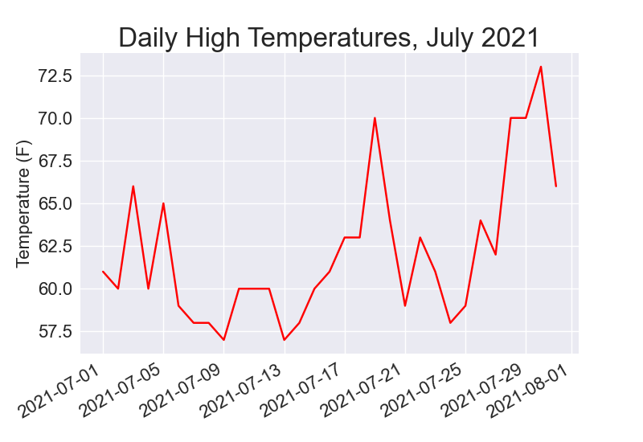
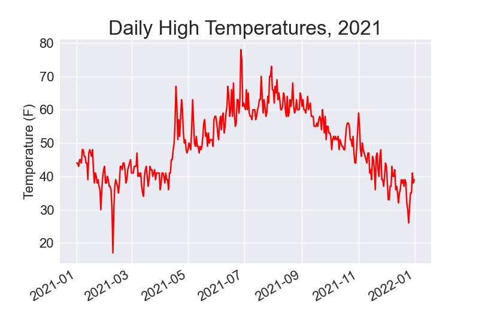
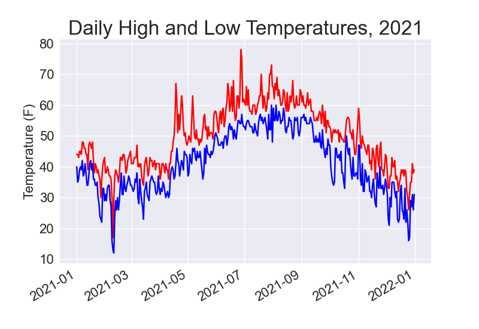
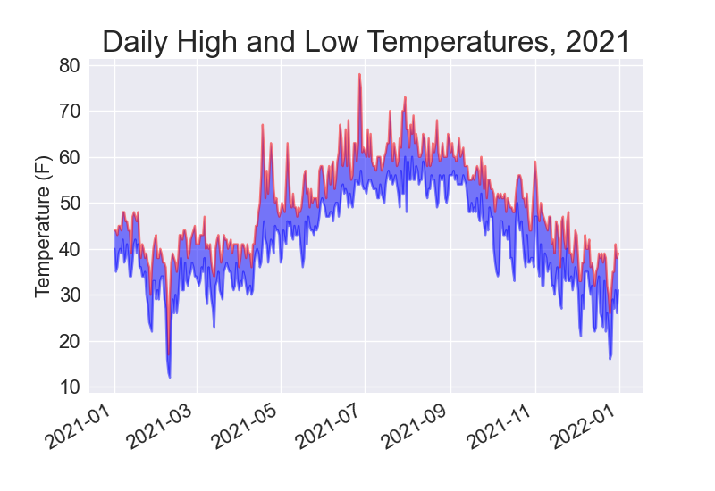
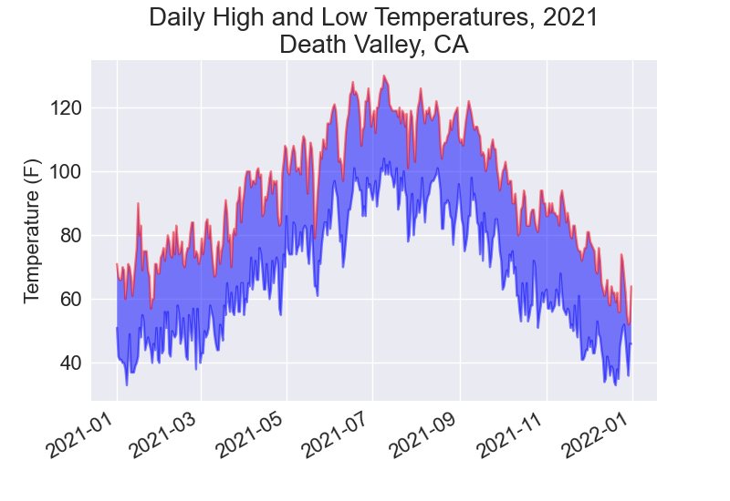

# Downloading Data

Here, we will download datasets from online sources and create working visualizations of that data. 

We will access and visualize data stored in two common data formats: `csv` and `json`

## The CSV File Format

One simple way to store data in a text file is to write the data as a series of values separated by commas, called `comma-separated-values`

### Parsing the CSV File Headers

Python's csv module in the standard library parses the lines in a CSV file and allows us to quickly extract the values we are interested in. 

To examine the first line of the file we have downloaded:

```python

from pathlib import Path
import csv

path = Path('weather_data/sitka_weather_07-2021_simple.csv')
lines = path.read_text(encoding='utf-8').splitlines()

reader = csv.reader(lines)
header_row = next(reader)
print(header_row)

```

First, we read the file and chain the `splitlines()` method to get a list of all lines in the file, which we assign to `lines`

Next, we build a `reader` object, which is an object that can be used to parse each line in the file. To make a reader object, we call the function `csv.reader()` and pass it the list of lines from the CSV file.

When given a `reader` object, the `next()` function returns the next line in the file, starting from the beginning of the file. 

Here, we call `next()` only once, so we get the first line of the file, which contains the file headers.

### Printing the Headers and Their Positions

To make it easier to understand the file header data, we can print each header and its position in the list:

```python

--snip--

reader = csv.reader(lines)
header_row = next(reader)

for index, column_header in enumerate(header_row):
    print(index, column_header)
```

output:
```
0 STATION
1 NAME
2 DATE
3 TAVG
4 TMAX
5 TMIN
```

The `enumerate()` function returns both the index of each item and the value of each item as we loop through a list. 

### Extracting and Reading Data

After knowing the columns of interest, we must read in some of that data. For instance, to read in the high temperature for each day:

```python
reader = csv.reader(lines)
header_row = next(reader)

# Extract high temperatures
highs = [int(row[4]) for row in reader]

print((highs))
```

output:
```
[61, 60, 66, 60, 65, 59, 58, 58, 57, 60, 60, 60, 57, 58, 60, 61, 63, 63, 70, 64, 59, 63, 61, 58, 59, 64, 62, 70, 70, 73, 66]
```

### Plotting the Data in a Temperature Chart

To visualize the temperature data we have, we will create a simple plot of the daily highs using Matplotlib, as shown here:

```python

from pathlib import Path
import csv

import matplotlib.pyplot as plt

path = Path('weather_data/sitka_weather_07-2021_simple.csv')
lines = path.read_text(encoding='utf-8').splitlines()

reader = csv.reader(lines)
header_row = next(reader)

# Extract high temperatures
highs = [int(row[4]) for row in reader]

# Plot the high temperatures
plt.style.use('seaborn-v0_8')
fig, ax = plt.subplots()
ax.plot(highs, color='red')

# Format plot
ax.set_title("Daily High Temperatures, July 2021", fontsize=24)
ax.set_xlabel('', fontsize=16)
ax.set_ylabel("Temperature (F)", fontsize=16)
ax.tick_params(labelsize=16)

plt.show()

```


#### The datetime Module

We can add dates to our graph to make it more useful. The first date from the weather data file is in the second row of the file. 

The data will be read in as a string, so we need a way to convert the string to an object representing the date. 

We can use the `strptime()` method from the `datetime` module.

The `strptime()` method can take a variety of arguments to determine how to interpret the date. The table below shows some of these arguments:

| Argument | Description                | Example |
|----------|----------------------------|---------|
| %Y       | Four-digit year            | 2021    |
| %y       | Two-digit year             | 21      |
| %B       | Full month name            | July    |
| %m       | Two-digit month (01 to 12) | 07      |
| %A       | Full weekday name          | Wednesday |
| %d       | Two-digit day (01 to 31)   | 14      |
| %H       | Hour (00 to 23)            | 14      |
| %I       | Hour (01 to 12)            | 02      |
| %p       | AM or PM                   | PM      |
| %M       | Minute (00 to 59)          | 30      |
| %S       | Second (00 to 59)          | 55      |

### Plotting Dates 

We can further extend our temperature visualization by adding dates to the x-axis of the plot:

```python

from pathlib import Path
import csv
from datetime import datetime

import matplotlib.pyplot as plt

path = Path('weather_data/sitka_weather_07-2021_simple.csv')
lines = path.read_text(encoding='utf-8').splitlines()
reader = csv.reader(lines)
header_row = next(reader)

# Extract dates and high temperatures
dates, highs = [], []

for row in reader:
    current_date = datetime.strptime(row[2], '%Y-%m-%d')
    high = int(row[4])
    dates.append(current_date)
    highs.append(high)

# Plot the high temperatures
plt.style.use('seaborn-v0_8')
fig, ax = plt.subplots()
ax.plot(dates, highs, color='red')

# Format plot
ax.set_title("Daily High Temperatures, July 2021", fontsize=24)
ax.set_xlabel('', fontsize=16)
ax.set_ylabel("Temperature (F)", fontsize=16)
fig.autofmt_xdate()
ax.tick_params(labelsize=16)

plt.show()

```



### Plotting a longer Timeframe

We can also plot an entire year of the weather data for Sitka:

```python

from pathlib import Path
import csv
from datetime import datetime

import matplotlib.pyplot as plt

path = Path("weather_data/Sitka Weather 2021.csv")
lines = path.read_text(encoding="utf-8").splitlines()
reader = csv.reader(lines)
header_row = next(reader)

# Extract dates and high temperatures
dates, highs = [], []

for row in reader:
    current_date = datetime.strptime(row[2], "%Y-%m-%d")
    high = int(row[4])
    dates.append(current_date)
    highs.append(high)

# Plot the high temperatures
plt.style.use("seaborn-v0_8")
fig, ax = plt.subplots()
ax.plot(dates, highs, color="red")

# Format plot
ax.set_title("Daily High Temperatures, 2021", fontsize=24)
ax.set_xlabel("", fontsize=16)
ax.set_ylabel("Temperature (F)", fontsize=16)
fig.autofmt_xdate()
ax.tick_params(labelsize=16)

plt.show()

```



### Plotting a Second Data Series

We can also make our graph more useful by adding the low temperatures. 

```python

from pathlib import Path
import csv
from datetime import datetime

import matplotlib.pyplot as plt

path = Path("weather_data/Sitka Weather 2021.csv")
lines = path.read_text(encoding="utf-8").splitlines()
reader = csv.reader(lines)
header_row = next(reader)

# Extract dates and high temperatures
dates, highs, lows = [], [], []

for row in reader:
    current_date = datetime.strptime(row[2], "%Y-%m-%d")
    high = int(row[4])
    low = int(row[5])
    dates.append(current_date)
    highs.append(high)
    lows.append(low)

# Plot the high temperatures
plt.style.use("seaborn-v0_8")
fig, ax = plt.subplots()
ax.plot(dates, highs, color="red")
ax.plot(dates, lows, color="blue")

# Format plot
ax.set_title("Daily High and Low Temperatures, 2021", fontsize=24)
ax.set_xlabel("", fontsize=16)
ax.set_ylabel("Temperature (F)", fontsize=16)
fig.autofmt_xdate()
ax.tick_params(labelsize=16)

plt.show()

```



### Shading an Area in the Chart

Having added two data series, we can now examine the range of temperatures for each day. We can shade the region between each day's high and low temperatures. 

To do so, we can use the `fill_between()` method, which takes a series of x-values and two series of y-values and fills the space between the two series of y-values.

```python

--snip--

ax.plot(dates, highs, color="red", alpha=0.5)
ax.plot(dates, lows, color="blue", alpha=0.5)
ax.fill_between(dates, highs, lows, facecolor='blue', alpha=0.5)

---
```

The `alpha` argument controls the color transparency. 



### Error Checking

At times, some weather stations collect different data than others, and some occasionally malfunction and fail to collect some of the data they are supposed to. Missing data can result in exceptions that crush our programs, unless we handle them properly. 

For instance, let us see what happens when we attempt to generate a temperature plot for Death Valley, California. 

```python

from pathlib import Path
import csv

path = Path("weather_data/Death Valley 2021 Weather Data.csv")
lines = path.read_text(encoding='utf-8').splitlines()

reader = csv.reader(lines)
header_row = next(reader)

for index, column_header in enumerate(header_row):
    print(index, column_header)

```

```
0 STATION
1 NAME
2 DATE
3 TMAX
4 TMIN
5 TOBS
```

The date is in the same position, index 2, but the high and low temperatures are at indexes 3 and 4, so we will need to change the indexes in our code to reflect the new positions. Instead of including an average temperature reading for the day, this station includes `TOBS`, a reading for a specific observation time.

After running the daily high and low code reflecting the index positions of maximum and minimum temperatures, we get an error:

```python
Traceback (most recent call last):
  File "/Users/pius/Projects/analytics-engineering/python/16-downloading-data/scripts/death_valley_highs_lows.py", line 17, in <module>
    high = int(row[3])
ValueError: invalid literal for int() with base 10: ''
pius@Piuss-MBP scripts %
```

The traceback tells us that Python cannot process the high temperature for one of the dates because it cannot turn an empty string ('') into an integer. 

So, we run error-checking code when the values are being read from the CSV file to handle exceptions that might arise. 

```python

import csv
from datetime import datetime
from pathlib import Path

import matplotlib.pyplot as plt

path = Path("weather_data/Death Valley 2021 Weather Data.csv")
lines = path.read_text(encoding="utf-8").splitlines()
reader = csv.reader(lines)
header_row = next(reader)

# Extract dates and high temperatures
dates, highs, lows = [], [], []

for row in reader:
    current_date = datetime.strptime(row[2], "%Y-%m-%d")
    try:
        high = int(row[3])
        low = int(row[4])
    except ValueError:
        print(f"Missing data for {current_date}")
    else:
        dates.append(current_date)
        highs.append(high)
        lows.append(low)

# Plot the high temperatures
plt.style.use("seaborn-v0_8")
fig, ax = plt.subplots()
ax.plot(dates, highs, color="red", alpha=0.5)
ax.plot(dates, lows, color="blue", alpha=0.5)
ax.fill_between(dates, highs, lows, facecolor="blue", alpha=0.5)

# Format plot
title = "Daily High and Low Temperatures, 2021\nDeath Valley, CA"
ax.set_title(title, fontsize=20)
ax.set_xlabel("", fontsize=16)
ax.set_ylabel("Temperature (F)", fontsize=16)
fig.autofmt_xdate()
ax.tick_params(labelsize=16)

plt.show()

```

The above code should raise a `ValueError` which should be handled by printing the error message that includes the date of the missing data. Then, the loop should continue processing the next row.

If all data for a date is retrieved without an error, the `else` block will run and the data will be appended to the appropriate lists. 



