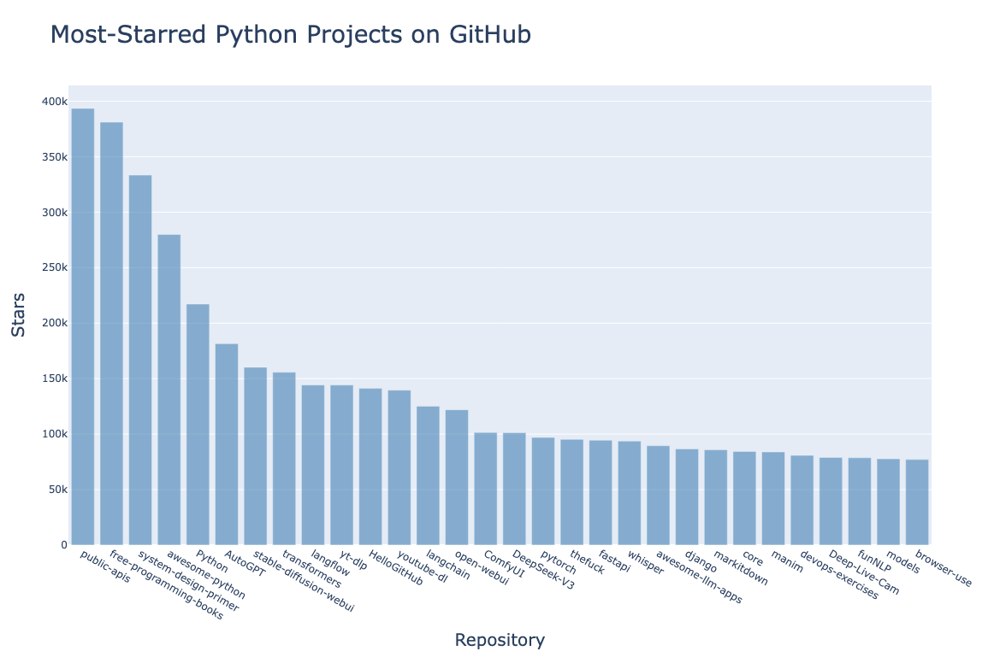

# Working with APIs

Here, we will learn how to write a self-contained program that generates a visualization based on data it retrieves. We will use an _application programming interface_ (__API__) to automatically request specific information from a website and then use that information to generate a visualization.

## Using an API

An API is a part of a website designed to interact with programs. Those programs use very specific URLs to request certain information. This kind of request is called an __API call__

The requested data will be returned in an easily processed format, such as JSON or CSV. Most apps that use external data sources, such as apps that integrate with social media sites, rely on API calls.

### Git and GitHub

For this case, we will use GitHub's API to request information about Python projects on the site, and then generate an interactive visualization of the relative popularity of these projects using Plotly.

GitHub takes its name from Git, a distributed version control system created by __Linus Torvalds__, the creator of Linux. Git allows multiple developers to work on the same codebase simultaneously without interfering with each other's changes. 

GitHub is a web-based platform that hosts Git repositories and provides additional features such as issue tracking, project management, and collaboration tools.

### Requesting Data Using an API Call

GitHub's API allows users to request a wide range of information through API calls.

We can explore how an API call looks like by entering the following code into our browser's address bar and pressing ENTER:

```
https://api.github.com/search/repositories?q=language:python+sort=stars
```

This call returns the number of Python projects currently hosted on GitHub, as well as information about the most popular Python repositories.

`https://api.github.com/` is the base URL for GitHub's API and works to direct the request to the part of GitHub that responds to API calls. The next part, `search/repositories`, tells the API to conduct a search through all the repositories on GitHub. 

The question mark (`?`) after `repositories` signals that we are about to pass an argument. The `q` stands for __query__, and the equal sign (`=`) lets us begin specifying a query (`q=`). In this case, we are querying for repositories that use the Python programming language (`language:python`). The plus sign (`+`) acts as a logical AND operator, allowing us to add another condition to our query. The second condition specifies that we want the results sorted by the number of stars (`sort=stars`).

When we enter this URL into our browser, we receive a JSON response containing information about Python repositories on GitHub, including their names, descriptions, star counts, and more.

```json
{
  "total_count": 25743069,
  "incomplete_results": false,
  "items": [
    {
      "id": 54346799,
      "node_id": "MDEwOlJlcG9zaXRvcnk1NDM0Njc5OQ==",
      "name": "public-apis",
      "full_name": "public-apis/public-apis",
      "private": false,
      "owner": {
        --- more data here ---
```

### Installing Requests and Processing an API Response

The `requests` package allows a Python program to easily request information from a website and examine the response. 

Now, we can write a program to automatically issue an API call and process the results:

```python

import requests

# Make an API call and check the response
url = "https://api.github.com/search/repositories"
url += "?q=language:python+sort=stars+stars:>10000"

headers = {"Accept": "application/vnd.github.v3+json"}
r = requests.get(url, headers=headers)
print(f"Status code: {r.status_code}")

# Convert the response object to a dictionary
response_dict = r.json()

# Process results
print(response_dict.keys())

```

In the previous code, we ask GitHub to only look for repositories with more than 10,000 stars. 

We get a status code of `200` which indicates a successful response. We then ask the API to return the information in JSON format, so we use the `json()` method to convert the information to a Python dictionary. 

```
Status code: 200
dict_keys(['total_count', 'incomplete_results', 'items'])
```

### Working with the Response Dictionary

Since we have the information needed, we can work with the data stored there. 

```python

import requests

# Make an API call and check the response
url = "https://api.github.com/search/repositories"
url += "?q=language:python+stars:>10000&sort=stars"

headers = {"Accept": "application/vnd.github.v3+json"}
r = requests.get(url, headers=headers)
print(f"Status code: {r.status_code}")

# Convert the response object to a dictionary
response_dict = r.json()

print(f"Total repositories: {response_dict['total_count']}")
print(f"Complete results: {not response_dict['incomplete_results']}")

# Explore information about the repositories
repo_dicts = response_dict['items']
print(f"Repositories returned: {len(repo_dicts)}")

# Examine the first repository
repo_dict = repo_dicts[0]
print(f"\nKeys: {len(repo_dict)}")

for key in sorted(repo_dict.keys()):
    print(key)

```

From the output, we get:

```
Status code: 200
Total repositories: 800
Complete results: True
Repositories returned: 30

Keys: 80
allow_forking
archive_url
--snip-- 
watchers_count
web_commit_signoff_required
```

We see that at the time of running this code, we had a total of 800 Python repositories with over 10,000 stars. The 200 status code tells us that GitHub was able to fully process the API call.

We can pull out the values for some of the keys above:

```python
---

# Explore information about the repositories
repo_dicts = response_dict["items"]
print(f"Repositories returned: {len(repo_dicts)}")

# Examine the first repository
repo_dict = repo_dicts[0]
print("\nSelected information about the first repository: ")
print(f"Name: {repo_dict['name']}")
print(f"Owner: {repo_dict['owner']['login']}")
print(f"Stars: {repo_dict['stargazers_count']}")
print(f"Repository: {repo_dict['html_url']}")
print(f"Created: {repo_dict['created_at']}")
print(f"Updated: {repo_dict['updated_at']}")
print(f"Description: {repo_dict['description']}")

```

The output is:

```
Status code: 200
Total repositories: 800
Complete results: True
Repositories returned: 30

Selected information about the first repository: 
Name: public-apis
Owner: public-apis
Stars: 393501
Repository: https://github.com/public-apis/public-apis
Created: 2016-03-20T23:49:42Z
Updated: 2026-01-26T08:07:30Z
Description: A collective list of free APIs
```

From the information, we see that the most-starred Python project on GitHub as of the running of the program is `public-apis` with its owner being the same name, and having __393501__ stars. The url was created in March 2016, and was updated earlier this year. 

According to the description, the repository has a list of free APIs that programmers might be interested in.

### Summarizing the Top Repositories

When we make a visualization for this data, we would want to include more than one repository. 

We will loop to print the selected information about each repository the API call returns so we can include them all in the visualization.

```python

import requests

# Make an API call and check the response
url = "https://api.github.com/search/repositories"
url += "?q=language:python+stars:>10000&sort=stars"

headers = {"Accept": "application/vnd.github.v3+json"}
r = requests.get(url, headers=headers)
print(f"Status code: {r.status_code}")

# Convert the response object to a dictionary
response_dict = r.json()

print(f"Total repositories: {response_dict['total_count']}")
print(f"Complete results: {not response_dict['incomplete_results']}")

# Explore information about the repositories
repo_dicts = response_dict["items"]
print(f"Repositories returned: {len(repo_dicts)}")

print("\nSelected information about each repository: ")

for repo_dict in repo_dicts:
  print(f"Name: {repo_dict['name']}")
  print(f"Owner: {repo_dict['owner']['login']}")
  print(f"Stars: {repo_dict['stargazers_count']}")
  print(f"Repository: {repo_dict['html_url']}")
  print(f"Created: {repo_dict['created_at']}")
  print(f"Updated: {repo_dict['updated_at']}")
  print(f"Description: {repo_dict['description']}")

```

The output of the API call is as shown:

```

Status code: 200
Total repositories: 800
Complete results: True
Repositories returned: 30

Selected information about each repository: 

Name: public-apis
Owner: public-apis
Stars: 393503
Repository: https://github.com/public-apis/public-apis
Created: 2016-03-20T23:49:42Z
Updated: 2026-01-26T08:16:47Z
Description: A collective list of free APIs

Name: free-programming-books
Owner: EbookFoundation
Stars: 381072
Repository: https://github.com/EbookFoundation/free-programming-books
Created: 2013-10-11T06:50:37Z
Updated: 2026-01-26T08:18:40Z
Description: :books: Freely available programming books

Name: system-design-primer
Owner: donnemartin
Stars: 333399
Repository: https://github.com/donnemartin/system-design-primer
Created: 2017-02-26T16:15:28Z
Updated: 2026-01-26T08:19:37Z
Description: Learn how to design large-scale systems. Prep for the system design interview.  Includes Anki flashcards.

Name: awesome-python
Owner: vinta
Stars: 279937
Repository: https://github.com/vinta/awesome-python
Created: 2014-06-27T21:00:06Z
Updated: 2026-01-26T08:20:40Z
Description: An opinionated list of awesome Python frameworks, libraries, software and resources.

Name: Python
Owner: TheAlgorithms
Stars: 217180
Repository: https://github.com/TheAlgorithms/Python
Created: 2016-07-16T09:44:01Z
Updated: 2026-01-26T08:13:31Z
Description: All Algorithms implemented in Python

--snip--


Name: models
Owner: tensorflow
Stars: 77691
Repository: https://github.com/tensorflow/models
Created: 2016-02-05T01:15:20Z
Updated: 2026-01-26T07:37:49Z
Description: Models and examples built with TensorFlow

Name: browser-use
Owner: browser-use
Stars: 77089
Repository: https://github.com/browser-use/browser-use
Created: 2024-10-31T16:00:56Z
Updated: 2026-01-26T08:20:09Z
Description: 🌐 Make websites accessible for AI agents. Automate tasks online with ease.

```

### Monitoring API Rate Limits

Most APIs have _rate limits_, which means there is a limit to how many requests one can make at a given time. 

To see if we are approaching i.e., GitHub's limits, we can enter `https://api.github.com/rate_limit` into a web browser.

We get the following output:

```json

{
  "resources": {
    "code_search": {
      "limit": 60,
      "remaining": 59,
      "reset": 1769416367,
      "used": 1,
      "resource": "code_search"
    },
    "core": {
      "limit": 60,
      "remaining": 59,
      "reset": 1769416367,
      "used": 1,
      "resource": "core"
    },
    "graphql": {
      "limit": 0,
      "remaining": 0,
      "reset": 1769419533,
      "used": 0,
      "resource": "graphql"
    },
    "integration_manifest": {
      "limit": 5000,
      "remaining": 5000,
      "reset": 1769419533,
      "used": 0,
      "resource": "integration_manifest"
    },
    "search": {
      "limit": 10,
      "remaining": 10,
      "reset": 1769415993,
      "used": 0,
      "resource": "search"
    }
  },
  "rate": {
    "limit": 60,
    "remaining": 59,
    "reset": 1769416367,
    "used": 1,
    "resource": "core"
  }
}

```

From `search`, we can see that the rate limit is 10 requests per minute and that we have 10 requests remaining for the current minute. The value associated with the key "reset" represents the time in _Unix_ or _epoch time (the number of seconds since midnight on January 1, 1970)_ when our quota will reset. If you reach this quota, you will get a short response letting you know that you have reached the API limit.

## Visualizing Repositories Using Plotly

We will visualize stars vs projects based on the project we have been working on.

```python

import requests
import plotly.express as px

# Make an API call and check the response
url = "https://api.github.com/search/repositories"
url += "?q=language:python+stars:>10000&sort=stars"

headers = {"Accept": "application/vnd.github.v3+json"}
r = requests.get(url, headers=headers)
print(f"Status code: {r.status_code}")

# Process overall results
response_dict = r.json()
print(f"Complete results: {not response_dict['incomplete_results']}")

# Process repository information
repo_dicts = response_dict["items"]
repo_names, stars = [], []

for repo_dict in repo_dicts:
    repo_names.append(repo_dict['name'])
    stars.append(repo_dict['stargazers_count'])

# Make visualization
fig = px.bar(x=repo_names, y=stars)
fig.show()

```

We can add a title, labels for each axis:

```python

# Make visualization
title = "Most-Starred Python Projects on GitHub"
labels = {'x': 'Repository', 'y': 'Stars'}

fig = px.bar(x=repo_names, y=stars, title=title, labels=labels)

fig.update_layout(
    title_font_size=28,
    xaxis_title_font_size=20,
    yaxis_title_font_size=20,
)
fig.show()

```

We could also add custom tooltips; when a user hovers over an individual bar to show the information the bar represents.

```python

# Process repository information
repo_dicts = response_dict["items"]
repo_names, stars, hover_texts = [], [], [] # new list - hover_texts

for repo_dict in repo_dicts:
    repo_names.append(repo_dict['name'])
    stars.append(repo_dict['stargazers_count'])
    
    # Build hover texts
    owner = repo_dict['owner']['login']
    description = repo_dict['description']
    hover_text = f"{owner}<br />{description}"
    hover_texts.append(hover_text)

# Make visualization
title = "Most-Starred Python Projects on GitHub"
labels = {'x': 'Repository', 'y': 'Stars'}

fig = px.bar(x=repo_names, y=stars, title=title, labels=labels, hover_name=hover_texts) # Adding hover_name

fig.update_layout(
    title_font_size=28,
    xaxis_title_font_size=20,
    yaxis_title_font_size=20,
)
fig.show()

```

To add clickable links, we can allow the user to visit any project's home page on GitHub.

```python

# Process repository information
repo_dicts = response_dict["items"]
repo_links, stars, hover_texts = [], [], []

for repo_dict in repo_dicts:
    repo_name = repo_dict['name']
    repo_url = repo_dict['html_url']
    repo_link = f"<a href='{repo_url}'>{repo_name}</a>"
    repo_links.append(repo_link)

    stars.append(repo_dict['stargazers_count'])
    
    # Build hover texts
    owner = repo_dict['owner']['login']
    description = repo_dict['description']
    hover_text = f"{owner}<br />{description}"
    hover_texts.append(hover_text)

# Make visualization
title = "Most-Starred Python Projects on GitHub"
labels = {'x': 'Repository', 'y': 'Stars'}

fig = px.bar(x=repo_links, y=stars, title=title, labels=labels, hover_name=hover_texts)

fig.update_layout(
    title_font_size=28,
    xaxis_title_font_size=20,
    yaxis_title_font_size=20,
)
fig.show()

```

We update the name of ths list we are creating from `repo_names` to `repo_links` to more accurately communicate the kind of information we are putting together for the chart. We use the HTML anchor tag, which has the form `<a href='{repo_url}'>{repo_name}</a>` to generate the link which combines the name and specific link. 

We could also customize the marker colors, for instance to darker blue, with some transparency.



## The Hacker News API
