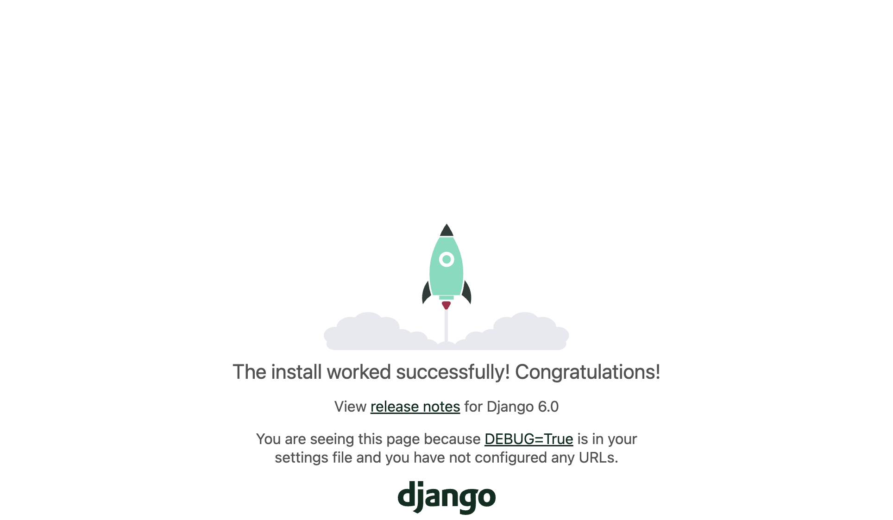
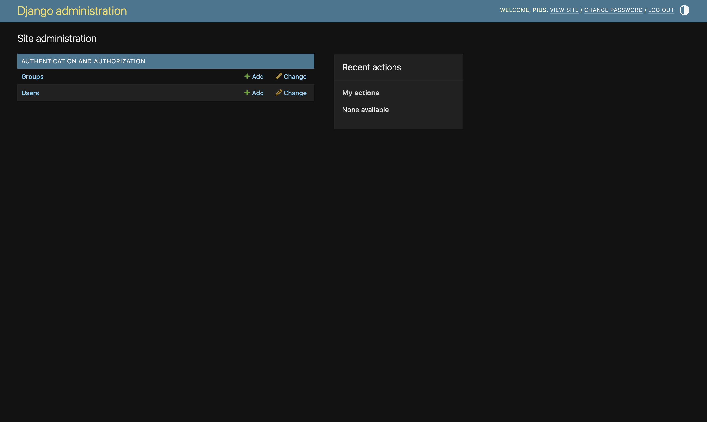
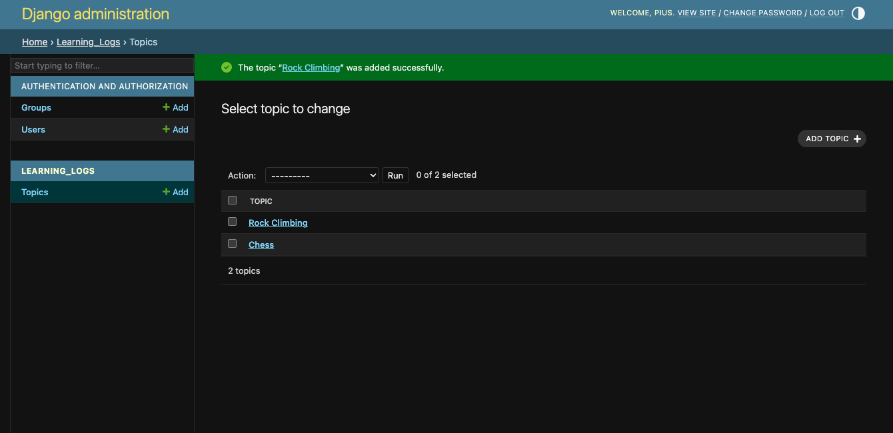
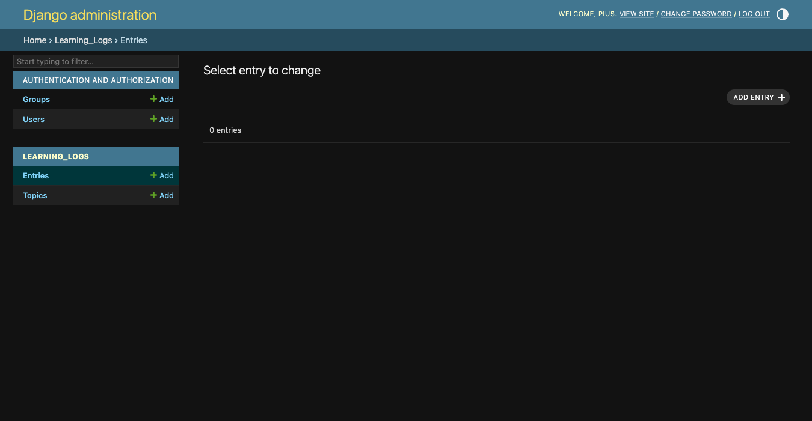

# Getting Started with Django

As the internet has evolved and continues to evolve, the line between websites and mobile apps has blurred. Both help users interact with data in a variety of ways. 

Fortunately, we can use Django to build a single project that serves a dynamic website as well as a set of mobile apps. 

`Django` is Python's most popular _web framework_, a set of tools designed for building interactive web applications.

`Django` can respond to page requests and make it easier to read and write to a database, manage users, and much more.

## Setting up a Project

When starting work on something as significant as a mobile application, we first need to describe the project's goals in a specification. Then we can identify manageable tasks to achieve those goals.

### Writing a Spec

A full spec details the project goals, describe the project's functionality, and discusses its appearance and user interface. 

Our spec is as follows:

    We will write a web app called Learning Log that allows users to log the topics they are interested in and make journal entries as they learn about each topic. The Learning Log home page will describe the site and invite users to either register or log in. Once logged in, a user can create new topics, add new entries, and read and edit existing entries.

## Project setup

First, we will set up a __virtual environment__. It is a place on our system where we can install packages and isolate them from all other Python packages. 

Can be done using the command:

```python

python -m venv env

```

or if using uv

```python

uv venv env

```

`uv` is a fast Python package installer and resolver written in Rust. It is a modern replacement for `pip` and `venv` that is significantly faster and more reliable.

To activate the environment, we run

```python

source env/bin/activate

```

and to stop using it, we run

```python

deactivate

```

So, to install `django`, we use:

```python

pip install --upgrade pip
pip install django

```

or for `uv`:

```python

uv pip install django

```

### uv

It is a:

- Fast Python package installer and resolver written in Rust
- Modern replacement for `pip`, `venv`, and `virtualenv`
- Significantly faster and more reliable dependency resolution
- Backward compatible with `pip`

or 

```

uv add django

```

if we are in a project with a `pyproject.toml` file. It adds dependencies to our project file and manages them.

### Creating a Project in Django

To create a project, we enter the following commands:

```python

django-admin startproject learning_log_project .

ls 

ls learning_log_project

```

`ls` is short for `list directory` which helps us confirm if `Django` has created a new directory for our project `learning_logs`. Once confirmed, we can also list what is inside the directory of our project.

```
__init__.py     asgi.py         settings.py     urls.py         wsgi.py
```

The `dot(.)` command at the end of the command creates the new project with a directory structure that will make it easy to deploy the app to a server when we are done developing it.

First, the `manage.py` created outside the project is a short program that takes in commands and feeds them to the relevant part of Django. They will be useful in managing tasks, such as working with databases and running servers.

The project directory contains four files with the most important ones are `settings.py`, `urls.py`, and `wsgi.py`. 

- The `settings.py` controls how Django interacts with our system and manages our project. 
- The `urls.py` file tells Django which pages to build in response to browser requests. 
- The `wsgi.py` file helps Django serve the files it creates. The filename is an acronym for `web server gateway interface`

### Creating the Database

Django stores most of the information for a project in a database, so next we need to create a database that Django can work with. 

We enter the following command:

```python

python manage.py migrate

```

The output is:

```python
(python) pius@Piuss-MBP learning_log % python manage.py migrate
Operations to perform:
  Apply all migrations: admin, auth, contenttypes, sessions
Running migrations:
  Applying contenttypes.0001_initial... OK
  Applying auth.0001_initial... OK
  Applying admin.0001_initial... OK
  Applying admin.0002_logentry_remove_auto_add... OK
  Applying admin.0003_logentry_add_action_flag_choices... OK
  Applying contenttypes.0002_remove_content_type_name... OK
  Applying auth.0002_alter_permission_name_max_length... OK
  Applying auth.0003_alter_user_email_max_length... OK
  Applying auth.0004_alter_user_username_opts... OK
  Applying auth.0005_alter_user_last_login_null... OK
  Applying auth.0006_require_contenttypes_0002... OK
  Applying auth.0007_alter_validators_add_error_messages... OK
  Applying auth.0008_alter_user_username_max_length... OK
  Applying auth.0009_alter_user_last_name_max_length... OK
  Applying auth.0010_alter_group_name_max_length... OK
  Applying auth.0011_update_proxy_permissions... OK
  Applying auth.0012_alter_user_first_name_max_length... OK
  Applying sessions.0001_initial... OK
```

Anytime we modify a database, we say we are _migrating_ the database. 

Issuing the `migrate` command for the first time tells Django to make sure the database matches the current state of the project. The first time we run this command in a new project using `SQLite`, Django will create a new database for us. Here, Django reports that it will prepare the database to store information it needs to handle administrative and authentication tasks.

Running the `ls` command shows that Django created another file called `db.sqlite3`

```python

(python) pius@Piuss-MBP learning_log % ls
db.sqlite3              learning_log_project    manage.py

```

_SQLite_ is a database that runs off a single file; it is ideal for writing simple apps because we will not have to pay much attention to managing the database.

### Viewing the Project

To make sure that Django has set up the project properly, we enter the `runserver` command to view the project in its current state:

```python

python manage.py runserver

```

```python
(python) pius@Piuss-MBP learning_log % python manage.py runserver
Watching for file changes with StatReloader
Performing system checks...

System check identified no issues (0 silenced).
January 28, 2026 - 07:51:01
Django version 6.0.1, using settings 'learning_log_project.settings'
Starting development server at http://127.0.0.1:8000/
Quit the server with CONTROL-C.

WARNING: This is a development server. Do not use it in a production setting. Use a production WSGI or ASGI server instead.
For more information on production servers see: https://docs.djangoproject.com/en/6.0/howto/deployment/
```

Django should start a server called the `development server` which should help us view the project, how it works as we build it. It can be viewed by following the url specified (`http://127.0.0.1:8000/`) after checking there are no issues, and then reporting the version of Django in use and the name of the settings file in use. 



From the url, we see that the project is listening for requests on port `8000` on out computer, also called a `localhost`. The term `localhost` refers to a server that only processes requests on our system; it does not allow anyone else to see the pages we are building.

`NOTE`: _If we receive the error message "That port is already in use," tell Django to use a different port by entering `python manage.py runserver 8001` and then cycling through higher numbers until you find an open port_.

## Starting an App

A Django _project_ is organized as a group of individual __apps__ that work together to make the project work as a whole. 

While keeping the development server, we will proceed to start an app:

```python

python manage.py startapp learning_logs

```

This command `startapp _appname_` tells Django to create the infrastructure needed to build an application. When we look in the project directory, there is a new folder called `learning_logs`. 

If we run `ls`, we see the following files:

```python
(python) pius@macbookpro learning_logs % ls
__init__.py     admin.py        apps.py         migrations      models.py       tests.py        views.py
```

The most important files are `models.py`, `admin.py`, and `views.py`. We will use `models.py` to define the data we want to manage in our application.

### Defining Models

While thinking about our data, each user will need to create a number of topics in their learning log. Each entry they make will be tied to a topic, and these entries will be displayed as text. We will also need to store the timestamp of each entry so we can show users when they made each one.

If we open the file `models.py` and look at its existing content:

```python

from django.db import models

# Create your models here.

```

A module called `models` is being imported, and we are being invited to create models of our own. A `model` tells Django how to work with the data that will be stored in the app. A model is a class; it has attributes and methods, just like every class we have discussed.

For the model for the topics users will store:

```python

from django.db import models


class Topic(models.Model):
    """A topic the user is learning about."""

    text = models.CharField(max_length=200)
    date_added = models.DateTimeField(auto_now_add=True)
    
    def __str__(self):
        """Return a string representation of the model."""
        return self.text
```

We have created a class called `Topic` which inherits from `Model`, a parent class included in Django that defines a model's basic functionality. We add two attributes to the Topic class: `text` and `date_added`.

The `text` attribute is a `CharField`, a piece of data that is made up or characters or text. We can use `CharField` when we want to store a small amount of text, such as a name, a title, or a city. When we define a `CharField` attribute, we have to tell Django how much space it should reserve in the database. Here, we give it a `max_length` of 200 characters, which should be enough to hold most topic names.

The `date_added` attribute is a `DateTimeField`, a piece of data that will record a date and time. We pass the argument `auto_now_add=True`, which tells Django to automatically set this attribute to the current date and time whenever the user creates a new topic.

It is a good idea to tell Django how we want it to represent an instance of a model. If a model has a `__str__()` method, Django calls that method whenever it needs to generate output referring to an instance of that model. Here, we have written a `__str__()` method that returns the value assigned to the text attribute.

NOTE: To see the different kinds of fields we can use in Django models, refer to the [Django Model Field Reference](https://docs.djangoproject.com/en/6.0/ref/models/fields/).

### Activating Models

To use our models, we have to tell Django to include our app in the overall project. We do this by modifying the `settings.py` file in the project directory, and adding our app to the `INSTALLED_APPS` list.

```python

# Application definition

INSTALLED_APPS = [
    # My apps
    'learning_logs',
    # Default Django apps
    'django.contrib.admin',
    'django.contrib.auth',
    'django.contrib.contenttypes',
    'django.contrib.sessions',
    'django.contrib.messages',
    'django.contrib.staticfiles',
]

```

We add the name of our app, `learning_logs`, to the list of installed apps.

Grouping apps together in a project helps keep track of them as the project grows to include more apps. We place our own apps before the default Django apps to make it easier to find them later.

Now, we need to tell Django to modify the database so it can store information related to the model `Topic` we just created. We do this in two steps:

```python

python manage.py makemigrations learning_logs
python manage.py migrate

```

The first command, `makemigrations`, tells Django to figure out how to modify the database so it can store information for the models we have created. The second command, `migrate`, applies those changes to the database.

The output of the first command is:

```python

(python) pius@macbookpro learning_log % python manage.py makemigrations learning_logs
Migrations for 'learning_logs':
  learning_logs/migrations/0001_initial.py
    + Create model Topic
(python) pius@macbookpro learning_log %

```

Django reports that it has created a migration file called `0001_initial.py` in the `migrations` directory of our app. This file contains the instructions Django will use to modify the database.

When we run the `migrate` command, Django applies the migration and modifies the database accordingly. The output is:

```python

Operations to perform:
  Apply all migrations: admin, auth, contenttypes, learning_logs, sessions
Running migrations:
  Applying learning_logs.0001_initial... OK
(python) pius@macbookpro learning_log %
```

Django reports that it has applied the migration we just created. Now the database is ready to store information related to the `Topic` model.

Whenever we want to modify the data that Learning Log manages, we will follow these three steps: 

- Modify the models in `models.py`

- Call `makemigrations` to tell Django to prepare a migration

- Tell Django to apply the migration to the database by calling `migrate`

### The Django Admin Site

Django makes it easy to work with our models through its admin site. It is only meant to be used by the site administrators, not by regular users of the site.

#### Setting up a Superuser

Django allows us to create a `superuser`, a user who has all privileges available on a site. A user's `privileges` control the actions they can take. The more restrictive privilege settings allow a user to only read public information on the site. Registered users typically have the privilege of reading their own private data and some selected information available only to members.

To create a superuser in Django, we enter the following command:

```python

python manage.py createsuperuser

```

The command above gives us prompts to enter a username, email address, and password for the superuser. After entering the required information, the superuser is created.

#### Registering Models with the Admin Site

Django includes some models in the admin site automatically, such as `User` and `Group`, but the models we create need to be added manually. 

When we started the `learning_logs` app, Django created an `admin.py` file in the same directory as `models.py`. 

```python

from django.contrib import admin

# Register your models here.
```

To register `Topic` with the admin site, we enter the following:

```python

from django.contrib import admin

from .models import Topic

admin.site.register(Topic)
```

The code above first imports the model we want to register, `Topic`. The dot in front of `models` tells Django to look for `models.py` in the same directory as `admin.py`. The code `admin.site.register()` tells Django to manage our model through the admin site.

To access the admin site, we use our superuser credentials. We navigate to `http://localhost:8000/admin/

This page allows us to add new users and groups, and change existing ones. We can also work with data related to the `Topic` model that we just defined.



#### Adding Topics

Now that `Topic` has been registered with the admin site, we can add our first topic. The steps are as follows:

- Click `Topics` to go to the topics page, which is mostly empty since we have not added any topics yet.

- Click `Add Topic` in the upper right corner to go to the page for adding a new topic.

- Enter a name for the topic in the `Text` field. The `Date added` field is filled in automatically. You will be sent back to the `Topics` page, which now shows the topic you just added.

After adding some topics, the examples page looks like this:



### Defining the Entry Model

For a user to record what they have been learning about chess and rock climbing, we need to define a model for the kinds of entries users can make in their learning logs. Each entry needs to be associated with a particular topic. This relationship is called a `one-to-many` relationship because each topic can have many entries, but each entry is associated with only one topic.

To define the `Entry` model, we open `models.py` in the `learning_logs` app and add the following code:

```python

from django.db import models


class Topic(models.Model):
    """A topic the user is learning about."""

    text = models.CharField(max_length=200)
    date_added = models.DateTimeField(auto_now_add=True)

    def __str__(self):
        """Return a string representation of the model."""
        return self.text


class Entry(models.Model):
    """Something specific learned about a topic"""

    topic = models.ForeignKey(Topic, on_delete=models.CASCADE)
    text = models.TextField()
    date_added = models.DateTimeField(auto_now_add=True)
    
    class Meta:
        verbose_name_plural = 'entries'
        
    def __str__(self):
        """Return a simple string representing the entry."""
        return f"{self.text[:50]}..."

```

In the code above, the `Entry` class inherits from Django's base `Model` class, just as `Topic` did. The first attribute, `topic` is a `ForeignKey` instance, meaning a reference to another record in the database. 

This is the code that connects each entry to a specific topic. Each topic is assigned a `key`, or ID, when it's created. When Django needs to establish a connection between two pieces of data, it uses the keys associated with each piece of information. 

We will use these connections shortly to retrieve all the entries associated with a certain topic. The `on_delete=models.CASCADE` argument tells Django that when a topic is deleted, all the entries associated with that topics should be deleted as well. This is known as a `cascading delete`.

Next, the attribute `text` is an instance of `TextField`. It does not need a size limit, because we do not want to limit the size of individual entries. The `date_added` attribute allows us to present entries in the order they were created, and to place a timestamp next to each entry.

The `Meta` class is nested inside the `Entry` class. The `Meta` class holds extra information for managing a model; here, it lets us set a special attribute telling Django to use `Entries` when it needs to refer to more than one entry. Without this, Django would refer to multiple entries as `Entrys`.

The `__str__()` method tells Django which information to show when it refers to individual entries. Because an entry can be a long body of text,`__str__()` returns just the first 50 characters of text. We also add an ellipsis to clarify that we are not always displaying the entire entry. 

### Migrating the Entry Model

Since we have added a new model, we need to migrate the database again. This process will become quite familiar: 

- You modify `models.py`,
- Run the command `python manage.py makemigrations app_name`
- Then run the command `python manage.py migrate`

The output:

```python

Migrations for 'learning_logs':
  learning_logs/migrations/0002_entry.py
    + Create model Entry
(python) pius@macbookpro learning_log % python manage.py migrate
Operations to perform:
  Apply all migrations: admin, auth, contenttypes, learning_logs, sessions
Running migrations:
  Applying learning_logs.0002_entry... OK
(python) pius@macbookpro learning_log %

```

A new migration called _0002_entry.py_ is generated, which tells Django how to modify the database to store information related to the model `Entry`. When we issue the `migrate` command, we see that Django applies this migration and everything worked properly.

### Registering Entry with the Admin Site.

We also need to register the `Entry` model. The `admin.py` should look like this:

```python

from django.contrib import admin

from .models import Topic, Entry

admin.site.register(Topic)
admin.site.register(Entry)

```

`Entries` is now listed:



We will then add an entry for one of our topic created earlier.


  The opening is the first part of the game, roughly the first ten moves or so. In the opening, it is a good idea to do three things - bring out your bishops and knights, try to control the center of the board, and castle your king.

  Of course, these are just guidelines. It will be important to learn when to follow these guidelines and when to disregard these suggestions.

When we click `Save`, we are brought back to the main admin page for entries. Here, we will see the benefit of using `text[:50]` as the string representation for each entry; it is much easier to work with multiple entries in the admin interface if you see only the first part of an entry, rather than the entire text of each entry. 

We can add more entries:

For `Chess`

  In the opening phase of the game, it is important to bring out your bishops and knights. These pieces are powerful and maneuverable enough to play a significant role in the beginning moves of a game.

For `Rock Climbing`

  One of the most important concepts in climbing is to keep your weight on your feet as much as possible. There's a myth that climbers can hang all day on their arms. In reality, good climbers have practiced specific ways of keeping their weight over their feet whenever possible.

These three entries will give us something to work with as we continue to develop `Learning Log`.

### The Django Shell

Now that we have entered some data, we can examine it programmatically through an interactive terminal session. This interactive environment is called the Django _shell_ and is a great place to test and troubleshoot our projects.

An example of an interactive shell session is as shown;

```python

(python) pius@macbookpro learning_log % python manage.py shell                                                     
14 objects imported automatically (use -v 2 for details).

Cmd click to launch VS Code Native REPL
Python 3.14.2 (main, Jan 14 2026, 23:37:46) [Clang 21.1.4 ] on darwin
Type "help", "copyright", "credits" or "license" for more information.
(InteractiveConsole)
>>> from learning_logs.models import Topic
>>> Topic.objects.all()
<QuerySet [<Topic: Chess>, <Topic: Rock Climbing>]>
>>>

```

After using the method `Topic.objects.all()` to get all instances of the model `Topic`, we get a `queryset`

We can further loop over the queryset just as we would loop over a list. Here is how we can see the ID that has been assigned to each topic object:

```python

>>> topics = Topic.objects.all()
>>> for topic in topics:
...     print(topic.id, topic)
... 
1 Chess
2 Rock Climbing
>>>

```

We assign the queryset to `topics` and then print each topic's `id` attribute and the string representation of each topic. We can see that `Chess` has an ID of `1` and `Rock Climbing` has an ID of `2`

If we know the ID of a particular object, we can use the method `Topic.objects.get()` to retrieve that object and examine any attribute the object has. We can look at the `text` and `date_added` values for `Chess`:

```python

>>> t = Topic.objects.get(id=1)
>>> t.text
'Chess'
>>> t.date_added
datetime.datetime(2026, 1, 30, 6, 26, 14, 3773, tzinfo=datetime.timezone.utc)
>>> 

```

We can also look at the entries related to a certain topic. Earlier we defined the `topic` attribute for the `Entry` model. This was a `Foreignkey`, a connection between each entry and a topic. Django can use this connection to get every entry related to a certain topic, like this:

```python

>>> t.entry_set.all()
<QuerySet [<Entry: The opening is the first part of the game, roughly...>, <Entry: In the opening phase of the game, it is important ...>]>
>>>

```

To get data through a foreign key relationship, we can use the lowercase name of the related model followed by an underscore and the word `set`. For example, say we have the models `Pizza` and `Topping`, and `Topping` is related to `Pizza` through a foreign key. If our object is called `my_pizza`, representing a single pizza, we can get all of the pizza's toppings using the code `my_pizza.topping_set.all()`

We will use this syntax when we begin to code the pages users can request. 

## Making Pages: The Learning Log Home Page

Making web pages with Django consists of three stages: `defining URLS`, `writing views`, and `writing templates`. One can do these in any order, but in this project, we will start by defining the URL pattern. 

A URL _pattern_ describes the way the URL is laid out. It also tells Django what to look for when matching a browser request with a site URL, so it knows which page to return.

Each URL then maps to a particular view. The `view` function retrieves and processes the data needed for that page. The view function often renders the page using a `template`, which contains the overall structure of the page. 

### Mapping a URL

Users request pages by entering URLs into a browser and clicking links, so we will need to decide what URLs are needed. The home page URL is first: it is the base URL people use to access the project. 

At the moment, the base URL: `http://localhost:8000/`, return the default Django site that lets us know the project was set up correctly. We will change this by mapping the base URL to Learning Log's home page.

In the main learning_log_project folder, we view `urls.py`:

```python

from django.contrib import admin
from django.urls import path

urlpatterns = [
    path('admin/', admin.site.urls),
]

```

The first two lines import the `admin` module and a function to build URL paths. The body of the file defines the `urlpatterns` variable. In this `urls.py` file, which defines URLs for the project as a whole, the `urlpatterns` variable includes sets of URLs from the apps in the project. The list includes the module `admin.site.urls`, which defines all the URLs that can be requested from the admin site.


In the main learning_log_project folder, we set `urls.py` by adding the URLs for `learning_logs`, so we add the following:

```python

from django.contrib import admin
from django.urls import path, include

urlpatterns = [
    path('admin/', admin.site.urls),
    path('', include('learning_logs.urls')),
]

```

We have imported the `include()` function and also added a line to include the module `learning_logs.urls`.

The default `urls.py` is in the `learning_log_project` folder, so we need to make a second `urls.py` file in the `learning_logs` folder.

```python

"""Defines URL patterns for learning logs."""

from django.urls import path

from . import views

app_name = 'learning_logs'
urlpatterns = [
    # Home page
    path('', views.index, name='index'),
]

```

We import the `views` module; the dot tells Python to import the `views.py` module from the same directory as the current `urls.py` module.

The variable `app_name` helps Django distinguish this `urls.py` file from files of the same name in other apps within the project. The variable `urlpatterns` in this module is a list of individual pages that can be requested from the `learning_logs` app.

The actual URL pattern is a call to the `path()` function, which takes three arguments:

- The first argument is a string that helps Django route the current request properly. Django receives the requested URL and tries to route the request to a view. It does this by searching all the URL patterns we have defined to find one that matches the current request. Django ignores the base URL for the project `(http://localhost:8000/)`, so the empty string ('') matches the base URL. Any other URL will not match this patter, and Django will return an error page if the URL requested does not match any existing URL patterns.

- The second argument in `path()` specifies which function to call in `views.py`. When a requested URL matches the pattern we are defining, Django calls the `index()` function from `views.py`.

- The third argument provides the name `index` for this URL so we can refer to it more easily in other files throughout the project. Whenever we want to provide a link to the home page, we will use this name instead of writing out a URL.

`Note`: In URLs (Routing), 

- Project-level `urls.py` routes to different apps

- App-level `urls.py` routes within the app

```python
# Project urls.py
path('', include('learning_logs.urls'))  # Delegates to app

# App urls.py
path('', views.index, name='index')  # Maps '' to index view
```

### Writing a View

Views are Python functions that:

- Receive HTTP request objects

- Process data (query database, calculations, etc)

- Return rendered templates

```python

def index(request):
  return render(request, 'learning_logs/index.html')

```

A view function takes in information from a request, prepares the data needed to generate a page, and then sends the data back to the browser. It often does this by using a template that defines what the page will look like. 

The file `views.py` in `learning_logs` was generated automatically when we ran the command `python manage.py startapp`. Here is how it looks currently:

```python

from django.shortcuts import render

# Create your views here.

```

Currently, this file just imports the `render()` function, which renders the response based on the data provided by the views. We add the following code for the home page:

```python

from django.shortcuts import render

def index(request):
  """The home page for Learning Log"""
  return render(request, 'learning_logs/index.html')

```

When a URL request matches the pattern we just defined, Django looks for a function called `index()` in the `views.py` file. Django then passes the `request` object to this. view function. In this case, we do not need to process any data for the page, so the only code in the function is a call to `render()`. The `render()` function here passes two arguments: the original `request` object and a template it can use to build the page. 

### Writing a Template

The template defines what the page should look like, and Django fills in the relevant data each time the page is requested. A template allows us to access any data provided by the view. 

Inside the `learning_logs` folder, we make a new folder called `templates`. Inside the `templates` folder, we make another folder called `learning_logs`. Albeit seeming redundant, it sets up a structure that Django can interpret unambiguously, even in the context of a large project with many individual apps. Inside the inner `learning_logs` folder, we make a new file called `index.html`. The path to the file will be `learning_log/learning_logs/templates/learning_logs/index.html`.

The template tags are:

- `` execute template logic
- `` Generates URLs dynamically
- `` defines replaceable sections
- `` inherit from parent template

We add the following code:

```html

<p>Learning Log</p>

<p>Learning Log helps you keep track of your learning, for any topic you're interested in.</p>

```

Now when we request the project's base URL, `http://localhost:8000/`, we should see the page we just built instead of the default Django page. Django will take the requested URL, and that URL will match the pattern ''; then Django will call the function `views.index()`, which will render the page using the template contained in `index.html`. 

The separation between URLs, views, and templates works quite well. It allows us to think about each aspect of a project separately. In larger projects, it allows individuals working on the project to focus on the areas in which they are strongest. For example, a database specialist can focus on the models, a programmer can focus on the view code, and a frontend specialist can focus on the templates.

## Building Additional Pages

We can now expand the Learning Log project to build two pages that display data: a page that lists all topics and a page that shows all entries for a particular topic. For each page, we will specify a URL pattern, write a view function, and write a template. But we will first create a base template that all templates in the project can inherit from.

### Template Inheritance

When building a website, some elements will need to be repeated on each page. Rather than writing these elements directly into each page, we can write a base template containing the repeated elements and then have each page inherit from the base. This approach will let us focus on developing the unique aspects of each page, and makes it much easier to change the overall look and feel of the project.

#### The Parent Template

We will create a template called `base.html` in the same directory as `index.html`. This file will contain elements common to all page; every other template will inherit from `base.html`. The only element we want to repeat on each page right now is the title at the top. Since we will include this template on every page, we can make the title a link to the home page:

```html

<p>
    <a href="">Learning Log</a>
</p>



```

The first part of this file creates a paragraph containing the name of the project, which also acts a home page link. To generate a link, we use a `template tag`, which is indicated by braces and percent signs ``. A template tag generates information to be displayed on a page. 

The template tag `` generates a URL matching the URL pattern defined in `learning_logs/url.py` with the name `index`. In this example, `learning_logs` is the _namespace_ and `index` is a uniquely named URL pattern assigned to `app_name` in the `learning_logs/url.py`file.

In a simple HTML page, a link is surrounded by the `anchor tag <a>`: `<a href="link_url">link text</a>`

Having the template tag generate the URL for us makes it much easier to keep our links up to date. We only need to change the URL patter in `urls.py`, and Django will automatically insert the updated URL the next time the page is requested. Every page in our project will inherit from `base.html`, so from now on, every page will have a link back to the home page.

On the last line, we insert a pair of `block` tags, named __content__ in this case, is a placeholder; the child template will define the kind of information that goes in the content block.

A child template does not have to define every block from its parent, so you can reserve space in parent templates for as many blocks as you like; the child template uses only as many as it needs. 

#### The Child Template

Now, we need to rewrite `index.html` to inherit from `base.html`. Add the following code to `index.html`

```html





<p>Learning Log helps you keep track of your learning, for any topic you're interested in.</p>



```

We have replaced the Learning Log title with the code for inheriting from a parent template. A child template must have an `` tag on the first line to tell Django which parent template to inherit from. The file `base.html` is part of `learning_logs`, so we include `learning_logs` in the path to the parent template. This line pulls in everything contained in the `base.html` template and allows `index.html` to define what goes in the space reserved by the content block.

We define the content block by inserting a ``

In summary, in template inheritance, we seek to avoid repetition by using parent-child relationships:

- Parent Template (`base.html`):

  ```html

  <p>
    <a href="">Learning Log</a>
  </p>
  

  ```

- Child Template (`index.html`):

  ```html

  
  
  <p>Page-specific content here</p>
  

  ```

In large projects, it is common to have one parent template called `base.html` for the entire site and parent templates for each major section of the site. All the section templates inherit from `base.html`, and each page in the site inherits from a section template.

Therefore, URLs, logic, and presentation are independent, developers can work on different layers, easily maintainable as URLs are changed in one place and templates update automatically, and template inheritance reduces code duplication.

So, for a practical example flow;

- Django checks URL patterns, matches `''` pattern,

- Calls `views.index(request)`

- `index()` renders `learning_logs/index.html`

- `index.html` extends `base.html`, inheriting the header

- Fills in the `content` block with page-specific text

- Returns complete HTML to browser


### The Topics Page

Now that we have an efficient approach to building pages, we can focus on building the `general topics page` and the `page to display entries for a single topic`. The topics page will show all topics that users have created, and it is the first page that will involve working with data.

#### The Topics URL Pattern

First, we define the URL for the topic page. It is common to choose a simple URL fragment that reflects the kind of information presented on the page. We will use the word `topics`, so the URL `https://localhost:8000/topics/` will return this page. 

For `learning_logs/urls.py`, we add the following changes:

```python
# Page that shows all topics
    path('topics/', views.topics, name="topics")
```

to form:

```python

"""Defines URL patterns for learning logs."""

from django.urls import path

from . import views

app_name = "learning_logs"
urlpatterns = [
    # Home page
    path("", views.index, name="index"),
    # Page that shows all topics
    path('topics/', views.topics, name="topics")
]

```

The new URL pattern is the word `topics`, followed by a forward slash. When Django examines a requested URL, this pattern will match any URL that has the base URL followed by `topics`. We can include or omit a forward slash at the end, but there cannot be anything else after the word `topics`, or the pattern would not match. Any request with a URL that matches this pattern will then be passed to the function `topics()` in `views.py`

#### The Topics View

The `topics()` function needs to retrieve some data from the database and send it to the template. Add the following to `views.py` at the application level.

```python

def topics(request):
    """Show all topics"""
    topics = Topic.objects.order_by('date_added')
    context = {'topics': topics}
    return render(request, 'learning_logs/topics.html', context)

```

to form

```python

from django.shortcuts import render

from .models import Topic

def index(request):
    """The home page for Learning Log"""
    return render(request, "learning_logs/index.html")

def topics(request):
    """Show all topics"""
    topics = Topic.objects.order_by('date_added')
    context = {'topics': topics}
    return render(request, 'learning_logs/topics.html', context)

```

The `topics()` function needs one parameter: the `request` object Django received from the server. We query the database by asking for the `Topic` objects sorted by the `date_added` attribute. We assign the resulting queryset to `topics`

We then define a context that we will send to the template. A `context` is a dictionary in which the keys are names we will use in the template to access the data we want, and the values are the data we need to send to the template.

In this case, there is one key-value pair, which contains the set of topics we will display on the page. When building a page that uses data, we call `render()` with the `request` object, the template we want to use, and the `context` dictionary.

#### The Topics Template

The template for the topics page receives the `context` dictionary, so the template can use the data that `topics()` provides. We will make a file called `topics.html` in the same directory as `index.html`.

```html





<p>Topics</p>
<ul>
    
        <li>{{ topic.text }} </li>
    
        <li> No topics have been added yet.</li>
    
</ul>



```

In the above, we seek to display a list of topics. `` inherits from the parent template `base.html`, pulls in the common HTML structure (header, navigation, etc.) from the parent, and must be the first line in a child template.

`` opens the content block defined in `base.html`, and everything between this and `` replaces the placeholder in the parent template.

We define a simple heading `<p>Topics</p>` and then `` loops through the `topics` variable (passed from the view) and iterates over each topic object one at a time. `{{ topic.text }}` outputs the text value of each topic and using `<li>`, we display a list item for each topic. 

`` is a special Django template tag that runs if the topics list is empty which displays fallback content when there's no data to loop through. In this case, shows "No topics have been added yet." `` closes the for loop and `` closes the content block.

##### Example flow

If `topics = [Topic(text="Chess"), Topic(text="Rock Climbing")]`, the rendered HTML would be: 

```html

<p>Topics</p>
<ul>
    <li>Chess </li>
    <li>Rock Climbing </li>
</ul>

```

If `topics` is empty, it would show:

```html

<p>Topics</p>
<ul>
    <li>No topics have been added yet.</li>
</ul>

```

### Individual Topic Pages

Next, we need to create a page that can focus on a single topic, showing the topic name and all the entries for that topic. We will define a new URL pattern, write a view, and create a template. We will also modify the topics page so each item in the bulleted list links to its corresponding topic page.

#### The Topic URL Pattern

The URL pattern for the topic page is a little different from the prior URL patterns because it will use the topic's `id` attribute to indicate which topic was requested. For example, if the user wants to see the detail page for the `Chess` topic, where id = 1, the URL will be `http://localhost:8000/topics/1/`. A pattern to match this URL we should place in `learning_logs/urls.py` is:

```python

# Snip previous code

urlpatterns = [
  # Snip
  # Detail page for a single topic
  path('topics/<int:topic_id>/', views.topic, name='topic'),
]

```

The initial part of the string tells Django to look for URLs that have the word `topics` after the base URL. The second part of the string, `/<int:topic_id>/`, matches an integer between two forward slashes and assigns the integer value to an argument called `topic_id`.

When Django finds a URL that matches this pattern, it calls the view function `topic()` with the value assigned to `topic_id` as an argument. 

#### The Topic View

The `topic()` function needs to get the topic and all associated entries from the database, much like what we did earlier in the Django shell:

```python

def topic(request, topic_id):
    """Show a single topic and all its entries."""
    topic = Topic.objects.get(id=topic_id)
    entries = topic.entry_set.order_by('-date_added')
    context = {"topic": topic, 'entries': entries}
    return render(request, "learning_logs/topic.html", context)

```

#### The Topic Template

The topic template needs to display the name of the topic and the entries. We also need to inform the user if no entries have been made yet for this topic.

```html





<p>Topic</p>
<ul>
    
        <li>
            <p> {{ entry.date_added|date:'M d, Y H:i' }} </p>
             <p> {{ entry.text|linebreaks }} </p>
        </li>
    
        <li> There are no entries for this topic yet.</li>
    
</ul>



```

This template displays all entries for a specific topic. It inherits from the base template and fills the content block with entry details. The template loops through an `entries` list passed from the view. For each entry, it displays the date when the entry was created and the entry text content. The `date` filter formats the date in a readable way showing month, day, year, and time (e.g., "Jan 15, 2026 14:30"). The `linebreaks` filter converts line breaks in the entry text into HTML paragraph tags, so when users write multi-line entries, the formatting is preserved on the page. If no entries exist for the topic, the `` block displays a message letting users know they haven't created any entries yet. Each entry is rendered as a list item containing the formatted date and text. The `` closes the loop, and `` closes the content block, completing the template inheritance from `base.html`.

#### Links from the Topics Page

We modify the `topics` template so each topic links to the appropriate page.

```html





<p>Topics</p>
<ul>
    
        <li>
          <a href="">
            {{ topic.text }} </a>
        </li>
    
        <li> No topics have been added yet.</li>
    
</ul>



```

We use the URL template tag to generate the proper link, based on the URL pattern in `learning_logs` with the name `topic`. This URL pattern requires a `topic_id` argument, so we add the attribute `topic.id` to the URL template tag. Now, each topic in the list of topics is a link to a topic page, such as `http://localhost:8000/topics/1/`

## Allowing Users to Enter Data

When building web apps, there must be a provision to allow any user to register an account with the application and start using it. 

We will build forms so users can add their own topics and entries, and even edit the existing entries. We will understand how Django guards against common attacks against form-based pages, implement authentication systems.


### Adding New Topics

Adding a form-based page works in much the same way as adding the pages we have already built: we define a URL, write a view function, and write a template. The one significant difference is the addition of a new module called `forms.py`, which will contain the forms.

#### The Topic ModelForm

Any page that lets a user enter and submit information on a web page involves an HTML element called a `form`. When users enter information, we need to `validate` that the information provided is the right kind of data and is not malicious. We then need to process and save valid information to the appropriate place in the database and Django automates much of the work involved.

The simplest way to build a form in Django is to use a `ModelForm`, which uses the information from the models we have already defined to create a form. We will use a `ModelForm` to create a form for adding new topics.

```python

from django import forms

from .models import Topic

class TopicForm(forms.ModelForm):
    """Form for adding a new topic."""

    class Meta:
        model = Topic
        fields = ['text']
        labels = {'text': ''}
```

The `TopicForm` class inherits from `forms.ModelForm`, which tells Django to build a form based on the information in the `Topic` model. The inner `Meta` class tells Django which model to use to build the form and which fields from the model to include in the form. In this case, we only want to include the `text` field, so we set `fields = ['text']`. We also set `labels = {'text': ''}` to tell Django not to generate a label for this field, since the placeholder text will make it clear what information should be entered into this field.

#### The new_topic URL

The URL for a new page should be short and descriptive. We will use `new_topic`, so the URL for this page will be `http://localhost:8000/new_topic/`. We add the following to `learning_logs/urls.py`:

```python

# Snip previous code
urlpatterns = [
    # Snip previous code
    # Page for adding a new topic
    path('new_topic/', views.new_topic, name='new_topic'),
]

```

This URL pattern sends requests for `http://localhost:8000/new_topic/` to the function `new_topic()` in `views.py`

#### The new_topic View Function

The `new_topic()` function needs to handle two different situations: initial requests for the `new_topic` page, in which case it should show a blank form; and the processing of any data submitted in the form. After data from a submitted form is processed, it needs to redirect the user back to the topics page. 

```python

from django.shortcuts import render, redirect

from .models import Topic
from .forms import TopicForm

# Snip previous code

def new_topic(request):
    """Add a new topic."""
    if request.method != 'POST':
        # No data submitted; create a blank form.
        form = TopicForm()
    else:
        # POST data submitted; process data.
        form = TopicForm(data=request.POST)
        if form.is_valid():
            form.save()
            return redirect('learning_logs:topics')

    # Display a blank or invalid form.
    context = {'form': form}
    return render(request, 'learning_logs/new_topic.html', context)

```

The `new_topic()` function first checks the method of the request. If the method is not `POST`, this means the user is requesting the page for the first time, so we create a blank form. If the method is `POST`, this means the user has submitted data, so we create a form instance with the submitted data and check if it is valid. If the form is valid, we save the new topic to the database and redirect the user to the topics page.

### GET and POST Requests

The two main types of requests we will use when building apps are `GET` and `POST`. A `GET` request is used for pages that only read data from the server. We use `POST` requests when the user needs to submit information through a form. We will use `GET` requests for the home page, the topics page, and the individual topic pages. We will use `POST` requests for the page that allows users to add new topics and entries.

The `new_topic()` function takes in the `request` object as a parameter. When the user initially requests the `new_topic` page, the method of the request is `GET`. Once the user has filled out and submitted the form, their browser will submit a POST request. Depending on the method of the request, the `new_topic()` function will either display a blank form or process the submitted data.

We use an `if` test to determine whether the request method is `GET` or `POST`. If the request method is not `POST`, the request is a `GET` request, so we create a blank form. We make an instance of `TopicForm`, assign it to the variable `form`, and send the form to the template in the context dictionary. Since we included no arguments when instantiating `TopicForm()`, the form will be blank.

If the request method is `POST`, we create a form instance with the submitted data by passing `data=request.POST` when instantiating `TopicForm()`. We then check if the form is valid. The validity checks include checking if i.e., the length of the text is less than 200 characters, as we specified in the `models.py`. If it is valid, we save the new topic to the database and redirect the user to the topics page.

Once we have processed the submitted data, we redirect the user to the topics page. We use the `redirect()` function to redirect the user to a different page after processing the form data. The argument we pass to `redirect()` is the name of the URL pattern for the topics page, so Django will generate the appropriate URL for us.

The `context` variable is defined at the end of the function, so it is available whether the request method is `GET` or `POST`. If the request method is `GET`, the form will be blank. If the request method is `POST`, but the submitted data was invalid, the form will contain error messages that explain what was wrong with the submitted data. In either case, we send the form to the template in the context dictionary and render the page.

#### The new_topic Template

Now, we need to create a template for the `new_topic` page. We will make a file called `new_topic.html` in the same directory as `index.html`.

```html




    <p>Add a new topic:</p>

    <form action="" method="post">
        
        {{ form.as_div }}
        <button name="submit">Add topic</button>
    </form>



```

This template extends `base.html`, so it has the same base structure as the rest of the pages in the project. The content block contains a heading and a form. The form is defined using the `<form>` tag, which has two important attributes: `action` and `method`. The `action` attribute tells the form where to send the submitted data; in this case, we send it back to the view function `new_topic`. The `method` attribute tells the form how to send the data; since we are submitting data, we use `POST`.

Django uses the template tag `` to prevent Cross-Site Request Forgery (CSRF) attacks. This tag generates a hidden form field with a unique token that Django checks when the form is submitted to ensure the request is coming from a trusted source. 

The line `{{ form.as_div }}` renders the form fields as HTML `<div>` elements. This is a convenient way to display the form, and it allows us to style the form using CSS if we want to. The button at the end of the form allows users to submit their input. When the user clicks the "Add topic" button, the form data is sent to the `new_topic` view function for processing. If the data is valid, a new topic is created in the database, and the user is redirected to the topics page where they can see their new topic listed.

#### Linking to the new_topic Page

Finally, we need to add a link to the `new_topic` page from the topics page. We will add this link at the end of the list of topics in `topics.html`.

```html





    <p>Topics</p>

    <ul>
        # Snip previous code
    </ul>

    <a href="">Add a new topic</a>



```

### Adding New Entries

Now that the user can add a new topic, they will want to add new entries too. We will again define a URL, write a view function and a template, and link to the page. But first, we will add another class to `forms.py`

#### The Entry ModelForm

We need to create a form associated with the `Entry` model, but this time, with a bit more customization than `TopicForm`:

```python

from django import forms

from .models import Topic, Entry

class TopicForm(forms.ModelForm):
    # Snip previous code

class EntryForm(forms.ModelForm):
    """Form for adding a new entry."""
    class Meta:
        model = Entry
        fields = ['text']
        labels = {'text': ''}
        widgets = {'text': forms.Textarea(attrs={'cols':80})}

```

We make a new class that inherits from `forms.ModelForm`. This class has a nested `Meta` class listing the model it is based on, and the field to include in the form. We again give the field `text` a blank label.

For `EntryForm`, we include the `widgets` attribute. A `widget` is an HTML form element, such as a single-line text box, multiline text area, or drop-down list. By including the widgets attribute we override django's default widget choices. Here, we use a `forms.Textarea` element with a width of 80 columns, instead of the default 40 columns which gives the user more room to write a meaningful entry.

#### The new_entry URL

New entries must be associated with a particular topic, so we need to include the topic's id in the URL pattern. We will use `new_entry` as the URL fragment, so the URL for this page will be `http://localhost:8000/topics/1/new_entry/`. We add the following to `learning_logs/urls.py`:

```python
# Snip previous code
urlpatterns = [
    # Snip previous code
    # Page for adding a new entry
    path('topics/<int:topic_id>/new_entry/', views.new_entry, name='new_entry'),
]

```

This URL pattern matches any URL that has the base URL followed by `topics/`, an integer, and then `new_entry/`. The integer in the URL is assigned to `topic_id`, which is passed to the `new_entry()` view function as an argument.

#### The new_entry View Function

The view function for adding a new entry is similar to the `new_topic()` function, but it also needs to associate the new entry with the correct topic. 

```python

from django.shortcuts import render, redirect

from .models import Topic
from .forms import TopicForm, EntryForm

# Snip previous code

def new_entry(request, topic_id):
    """Add a new entry for a particular topic."""
    topic = Topic.objects.get(id=topic_id)

    if request.method != 'POST':
        # No data submitted; create a blank form.
        form = EntryForm()
    else:
        # POST data submitted; process data.
        form = EntryForm(data=request.POST)
        if form.is_valid():
            new_entry = form.save(commit=False)
            new_entry.topic = topic
            new_entry.save()
            return redirect('learning_logs:topic', topic_id=topic_id)

    # Display a blank or invalid form.
    context = {'topic': topic, 'form': form}
    return render(request, 'learning_logs/new_entry.html', context)

```

The `new_entry()` function takes in the `request` object and the `topic_id` as parameters. The first line of the function retrieves the topic associated with the given `topic_id` from the database. The rest of the function is similar to `new_topic()`, but with some differences. When processing the submitted data, we create a new entry object from the form data but do not save it to the database yet by passing `commit=False` to `form.save()`. This allows us to set the `topic` attribute of the new entry to the topic we retrieved at the beginning of the function. After setting the topic, we save the new entry to the database. Finally, we redirect the user to the topic page for the topic they just added an entry to, passing `topic_id` as an argument to the URL pattern.

#### The new_entry Template

The template for adding a new entry is similar to the template for adding a new topic, but it also needs to display the name of the topic that the user is adding an entry for.

```html




    <p><a href="">{{ topic }}</a></p>

    <p>Add a new entry:</p>
    <form action="" method="post">
        
        {{ form.as_div }}
        <button name="submit">Add entry</button>
    </form>



```

Here, we show the topic name as a link back to the topic page. The form's action attribute is set to the URL for adding a new entry for this topic, which includes the topic's id. The rest of the form is similar to the `new_topic` template, with a CSRF token, the form fields rendered as divs, and a submit button. When the user submits the form, they will be redirected back to the topic page where they can see their new entry listed under that topic.

#### Linking to the new_entry Page

Finally, we need to add a link to the `new_entry` page from the individual topic page. We will add this link at the end of the list of entries in `topic.html`.

```html





    <p>Topic: {{ topic }}</p>
    <p>Entries:</p>
    <p>
        <a href="">Add new entry</a>
    </p>

    <ul>
        # Snip previous code
    </ul>

    <a href="">Add a new entry</a>



```

We place the link to add a new entry right after the topic name and before the list of entries, because adding a new entry will be the most common action users will take on this page. The link uses the URL template tag to generate the URL for adding a new entry for this topic, passing the topic's id as an argument. When users click this link, they will be taken to the form for adding a new entry, and after submitting the form, they will be redirected back to this topic page where they can see their new entry listed.

### Editing Entries

Now, we will make a page that allows users to edit existing entries. We will define a URL pattern, write a view function, and create a template for editing entries. We will also add links to the edit page from the topic page.

#### The edit_entry URL

The URL for the page needs to pass the ID of the entry to be edited. We will use `edit_entry` as the URL fragment, so the URL for this page will be `http://localhost:8000/topics/1/edit_entry/`. We add the following to `learning_logs/urls.py`:

```python

# Snip previous code
urlpatterns = [
    # Snip previous code
    # Page for editing an entry
    path('topics/<int:topic_id>/edit_entry/<int:entry_id>/', views.edit_entry, name='edit_entry'),
]

```

This URL pattern matches any URL that has the base URL followed by `topics/`, an integer for the topic id, `edit_entry/`, and another integer for the entry id. The integers in the URL are assigned to `topic_id` and `entry_id`, which are passed to the `edit_entry()` view function as arguments.

#### The edit_entry View Function

When the `edit_entry()` function receives a `GET` request, it needs to retrieve the entry to be edited and pre-populate the form with the current entry data. When it receives a `POST` request, it needs to validate the submitted data, save the changes to the database, and redirect the user back to the topic page.

```python

from django.shortcuts import render, redirect

from .models import Topic, Entry
from .forms import TopicForm, EntryForm

# Snip previous code

def edit_entry(request, entry_id):
    """Edit an existing entry."""
    entry = Entry.objects.get(id=entry_id)
    topic = entry.topic

    if request.method != 'POST':
        # Initial request; pre-fill form with the current entry.
        form = EntryForm(instance=entry)
    else:
        # POST data submitted; process data.
        form = EntryForm(instance=entry, data=request.POST)
        if form.is_valid():
            form.save()
            return redirect('learning_logs:topic', topic_id=topic.id)

    context = {'entry': entry, 'topic': topic, 'form': form}
    return render(request, 'learning_logs/edit_entry.html', context)

```

We initially import the `Entry` model and then get the entry object that the user wants to edit using the `entry_id` passed in the URL. We also get the topic associated with this entry, since we will need to redirect the user back to the topic page after they submit their changes.

If the request method is not `POST`, we create a form instance with the current entry data by passing `instance=entry` when instantiating `EntryForm()`. This pre-populates the form with the existing entry data, allowing the user to see the current content and make changes to it. 

If the request method is `POST`, we create a form instance with both the current entry data and the submitted data by passing both `instance=entry` and `data=request.POST`. This allows us to validate the submitted data against the existing entry. If the form is valid, we save the changes to the database and redirect the user back to the topic page. 

The context dictionary includes the entry, topic, and form, which are sent to the template for rendering the edit entry page.

#### The edit_entry Template

Next, we create an `edit_entry.html` template for the edit entry page.

```html




    <p><a href="">{{ topic }}</a></p>

    <p>Edit entry:</p>

    <form action="" method="post">
        
        {{ form.as_div }}
        <button name="submit">Save changes</button>
    </form>



```

The `action` argument sends the form back to the `edit_entry` view function for processing. We include `entry.id` in the URL so the view function knows which entry is being edited. The rest of the form is similar to the previous forms, with a CSRF token, the form fields rendered as divs, and a submit button. When the user submits the form, they will be redirected back to the topic page where they can see their changes reflected in the entry.

#### Linking to the edit_entry Page

Finally, we need to add a link to the `edit_entry` page from the individual topic page. We will add this link next to each entry in `topic.html`.

```html





    <p>Topic: {{ topic }}</p>
    <p>Entries:</p>

    <ul>
        
            <li>
                <p>{{ entry.date_added|date:'M d, Y H:i' }}</p>
                <p>{{ entry.text|linebreaks }}</p>
                <p>
                    <a href="">Edit entry</a>
                </p>
            </li>
        
            <li> There are no entries for this topic yet.</li>
        
    </ul>

    <a href="">Add a new entry</a>



```

We include the edit link after each entry's date and text has been displayed. We use the `` template tag to generate the URL for the named URL pattern `edit_entry`, along with the ID attribute of the current entry in the loop (`entry.id`). When users click the "Edit entry" link, they will be taken to the edit entry page where they can modify the content of that entry. After submitting their changes, they will be redirected back to the topic page where they can see their updated entry.