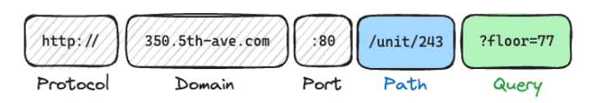

# APIs in Python

## Introduction to APIs

An API (Application Programming Interface) is a set of rules and protocols that allows different software applications to communicate with each other. APIs enable developers to access the functionality of a service or application without needing to understand its internal workings. They are commonly used to retrieve data from web services, interact with databases, and integrate third-party services into applications.

The most common types of APIs include:

- **REST (Representational State Transfer)**: A popular architectural style for designing networked applications and is known for its simplicity and ease of use. It uses standard HTTP methods (`GET`, `POST`, `PUT`, `DELETE`) and is stateless. Stateless means that each request from a client to a server must contain all the information needed to understand and process the request, and the server does not store any information about the client's state between requests.

- **SOAP (Simple Object Access Protocol)**: A protocol for exchanging structured information in web services. It relies on XML and is more rigid than REST. It takes a very formal approach and thus is used where robustness and strict protocols are required i.e., in enterprise applications.

- **GraphQL**: It takes a more sophisticated approach, focusing on precise and flexible data retrieval, minimizing the amount of data transferred over the network, and optimizing the performance of API calls.

## An anatomy of an API request

When making an API request, there are several components involved: 

### URL (Uniform Resource Locator)

A URL is the address of the API endpoint you want to access. It typically consists of a base URL and a path that specifies the resource you want to interact with. For example, `https://api.example.com/data` is a URL where `https://api.example.com` is the base URL and `/data` is the path.

The URL comprises of five main components as shown below:



1. The `protocol` specifies the communication protocol used to access the resource, such as `http` or `https`. 

2. The `domain` is the address of the server hosting the API, such as `api.example.com`.

3. The `port` is an optional component that specifies the port number on which the server is listening for requests. If not specified, it defaults to `80` for HTTP and `443` for HTTPS.

4. The `path` specifies the specific resource or endpoint you want to access, such as `/data`.

5. The `query parameters` are optional key-value pairs that can be included in the URL to provide additional information or filter the results. They are typically appended to the URL after a `?` and separated by `&`, such as `?key=value&key2=value2`.

So, the `protocol` is the means of transportation, the `domain` is the street address of the office building, the `port` is the specific door to enter, the `path` is the specific room or department within the building, and the `query parameters` are like instructions or filters for what you want to do once you enter the building.

### HTTP Methods

HTTP methods, also known as HTTP verbs, are used to indicate the desired action to be performed on a resource. The most common HTTP methods include:

- `GET`: Used to `retrieve` data from a server. It is a read-only operation and should not have any side effects on the server.

- `POST`: Used to `send` data to a server to create a new resource. It can have side effects on the server, such as creating a new entry in a database.

- `PUT`: Used to `update` an existing resource on the server. It can also be used to create a new resource if it does not already exist.

- `DELETE`: Used to `delete` a resource from the server. It is a destructive operation and should be used with caution.

```python

import requests

# GET
response = requests.get('https://api.example.com/data')

# POST
data = {'key': 'value'}
response = requests.post('https://api.example.com/data', json=data)

# PUT
updated_data = {'key': 'new_value'}
response = requests.put('https://api.example.com/data/1', json=updated_data)

# DELETE
response = requests.delete('https://api.example.com/data/1')
```

### Headers & Status Codes

When you make an API request we may want to include additional information in the request, such as authentication credentials or content type. This information is typically included in the headers of the request. Headers are key-value pairs that provide metadata about the request or response.

Examining a GET request and its response, we see both messages are very similar in structure and can both be split into three distinct parts.

For a request message, an example output would be:

```js
GET /data HTTP/1.1
Host: api.example.com
Accept: application/json
```

For a response message, an example output would be:

```js
HTTP/1.1 200 OK
Content-Type: application/json
Content-Language: en-US
Last-Modified: Wed, 21 Oct 2020 07:28:00 GMT

{
    "id": 1,
    "name": "Example Data",
    "value": "This is an example of a JSON response."
}
```

In the request message, the first line contains the HTTP method (`GET`), the path (`/data`), and the HTTP version (`HTTP/1.1`). The subsequent lines contain headers that provide additional information about the request, such as the host and the accepted content type.

Python allows us to specify headers in our API requests using the `headers` parameter in the `requests` library. For example:

```python
import requests

headers = {'accept': 'application/json'}
response = requests.get('https://api.example.com/data', headers=headers)

```

We can read the response headers using the `headers` attribute of the response object. For example:

```python
response.headers['content-type']

# or
response.headers.get('content-type')
```

We can also check the status code of the response using the `status_code` attribute. The status code indicates the result of the request, with codes in the `200` range indicating success, codes in the `400` range indicating client errors, and codes in the `500` range indicating server errors.

```python

response = requests.get('https://api.example.com/data')
response.status_code

# Or
response = requests.get('https://api.example.com/this-does-not-exist')
response.status_code == requests.codes.not_found  # This will return True if the status code is 404
```

## API Authentication

1. `Basic authentication` is the simplest form of authentication, where the client sends a username and password with each request. This method is not secure as the credentials are sent in plain text and can be easily intercepted.

For this, one can add a basic authentication header to the request using the `auth` parameter in the `requests` library. For example:

```python
import requests

requests.get('https://api.example.com/data', auth=('username', 'password'))
```

2. `API Key or Token-based authentication` is a more secure method where the client is issued a unique API key or token that must be included in the request headers. This method allows for better control and management of access to the API.

For this, we have two options; add a query parameter to the URL or include the API key in the headers and is preferred. For example:

```python
import requests

params = {'api_key': 'your_api_key'}

response = requests.get('https://api.example.com/data', params=params)

# Or

headers = {'Authorization': 'Bearer your_api_key'}

response = requests.get('https://api.example.com/data', headers=headers)
```

3. `JWT (JSON Web Token) authentication` is a more advanced method that involves the client obtaining a token after successful authentication, which is then used for subsequent requests. The token contains encoded information about the user and can be verified by the server.

3. `OAuth (Open Authorization)` is a widely used authentication protocol that allows users to grant third-party applications access to their resources without sharing their credentials. It involves a series of steps where the user authorizes the application, and the application receives an access token to access the user's resources.

Errors in the 400 range are client errors, which means that the request made by the client was invalid in some way. Errors in the 500 range are server errors, which means that there was an issue on the server side while processing the request.

## Working with structured data

When working with APIs, the data returned is often in a structured format such as JSON (JavaScript Object Notation) or XML (eXtensible Markup Language). These formats allow for easy parsing and manipulation of the data in programming languages like Python.

When requesting data from an API, you can specify the desired format using the `Accept` header in your request. For example, to request JSON data, you can set the header as follows:

```python
import requests
headers = {'Accept': 'application/json'}
response = requests.get('https://api.example.com/data', headers=headers)
```

To send data to an API, you can use the `Content-Type` header to specify the format of the data being sent. For example, to send JSON data, you can set the header as follows:

```python
import requests

headers = {'Content-Type': 'application/json'}
data = {'key': 'value'}
response = requests.post('https://api.example.com/data', json=data, headers=headers)
```

## Error Handling

When making API requests, it's important to handle errors gracefully. APIs can return various error codes to indicate different types of issues that may arise during the request.

Error codes in the `400` range include:

- `400 Bad Request`: The server could not understand the request due to invalid syntax.
- `401 Unauthorized`: The client must authenticate itself to get the requested response.
- `403 Forbidden`: The client does not have access rights to the content.
- `404 Not Found`: The server can not find the requested resource.

Error codes in the `500` range include:
- `500 Internal Server Error`: The server has encountered a situation it doesn't know how to handle.
- `502 Bad Gateway`: The server, while acting as a gateway or proxy, received an invalid response from the upstream server.
- `503 Service Unavailable`: The server is not ready to handle the request, often due to being overloaded or down for maintenance.
- `504 Gateway Timeout`: The server, while acting as a gateway or proxy, did not receive a timely response from the upstream server.

To handle these errors in Python, you can use the `requests` library to make API calls and check the status code of the response. Here's an example:

```python
import requests

from requests.exceptions import HTTPError, ConnectionError

try:
    r = requests.get('https://api.example.com/data')
    r.raise_for_status()  # This will raise an HTTPError if the status code is 4xx or 5xx
    print(r.status_code)
    print(r.json())

except ConnectionError as ce:
    print(f"Connection error occurred: {ce}")

except HTTPError as http_err:
    print(f"HTTP error occurred: {http_err}")

except Exception as err:
    print(f"An error occurred: {err}")
```